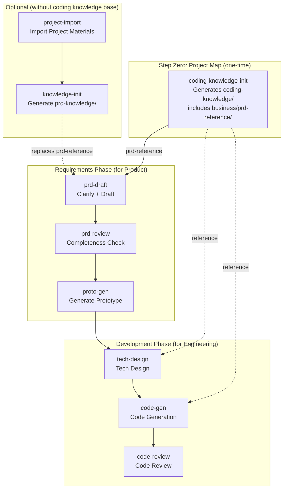

# C-ROOM

English | [中文](README.md)

> One command in Claude Code to run the full cycle: Requirements → PRD → Prototype → Tech Design → Code → Review.

C-ROOM is a batteries-included collection of Claude Code Skills. After installation, just describe what you need in natural language — AI handles the complete product-to-engineering loop.

## The Problem

The bottleneck of AI Coding isn't "can AI write good code" — it's **having to re-explain your project from scratch every time**.

Business logic lives in the PM's head. System architecture lives in the developer's head. Call chains live in code comments. Every AI collaboration session starts with manually assembling context. Productivity depends entirely on human effort.

What C-ROOM does: **Capture expert knowledge once, auto-load it across the entire pipeline.**

| Without C-ROOM | With C-ROOM |
|----------------|------------|
| Grep across 10+ repos for 30 min to find the target method | Locate method signature and line number in seconds |
| AI fabricates system state when writing PRDs, endless revisions | Asks 5-8 clarification rounds first, generates based on real system state |
| Tech design misses cross-service impact, discovered after deploy | Auto-traces call chains, lists all affected services |
| Re-explain project background every conversation | Knowledge captured once, auto-loaded at every step |

## Best For

- **Multi-repo microservice projects** (ideal scenario): Java/Spring, Go, PHP, Python, Node.js, Vue/React
- **Monorepo projects** work too — cross-service features just won't apply
- **Requires**: [Claude Code](https://docs.anthropic.com/en/docs/claude-code) installed

## Installation

```bash
git clone https://github.com/wuyining0130/c-room.git /tmp/c-room && bash /tmp/c-room/install.sh && rm -rf /tmp/c-room
```

Or say this in Claude Code:

```
Install all skills from https://github.com/wuyining0130/c-room
```

Update to latest:

```
Update all skills from https://github.com/wuyining0130/c-room to local
```

## Quick Start

After installation, open Claude Code in your project directory:

**Step 1: Build the knowledge base** (one-time setup)

Tell AI about your repos:

```
Initialize coding knowledge base. Repo info:

Module    SubModule   Service         Local Path               Description
Trade     Order       order-srv      ~/repos/order-srv        Order service
                      pay-srv        ~/repos/pay-srv          Payment service
          Fulfill     fulfill-srv    ~/repos/fulfill-srv      Fulfillment service
```

AI will auto-scan your code and generate a 3-layer knowledge base (infra → business → repos). Takes about 15 minutes.

**Step 2: Start using**

Once the knowledge base is ready, all subsequent operations auto-load project context:

```
I want to build a new feature: users can batch export orders
```

AI will ask clarification questions (scope, roles, flows), then generate a PRD. From there you can continue to tech design, code generation, and code review.

## What is a Project Studio?

All C-ROOM skills work around a **Project Studio** — a dedicated local workspace for your business module where all knowledge bases, requirement docs, tech designs, and prototypes live together.

### Setting Up a Studio

```
mkdir my-project && cd my-project
```

Open Claude Code in this directory and run in order:

1. **Build the coding knowledge base** (step zero, one-time only)
   ```
   Initialize coding knowledge base. Repo info:
   Module    SubModule   Service         Local Path              Description
   Trade     Order       order-srv      ~/repos/order-srv       Order service
                         pay-srv        ~/repos/pay-srv         Payment service
   ```
   Output: `coding-knowledge/` — 3-layer structured technical knowledge base. Once built, all downstream skills (PRD writing, tech design, code generation) auto-load it.

2. **Start working on requirements** (repeatable, each requirement gets its own directory)
   ```
   I want to build a new feature: users can batch export orders
   ```
   Output: `requirements/batch-export/` — PRD, prototype, tech design, code review report

> **Note**: `project-import` and `knowledge-init` are for scenarios without a full coding knowledge base — e.g., onboarding onto an unfamiliar project where you need to import materials and generate a PRD-focused knowledge base first. If you already have `coding-knowledge/`, its `business/prd-reference/` already contains existing features, business flows, and role permissions needed for PRD writing. You can skip these two steps and start directly with requirements.

### Final Studio Directory Structure

```
my-project/                              # Project Studio root
├── CLAUDE.md                            # AI coding guidelines (auto-generated)
│
├── coding-knowledge/                    # coding-knowledge-init output
│   ├── INDEX.md                         # Top-level entry (with intent routing table)
│   ├── config.yaml                      # Project config
│   ├── knowledge-gaps.md                # Knowledge gap report
│   ├── infra/                           # Infra layer (tech stack, middleware, conventions)
│   ├── business/                        # Business layer (glossary, architecture, domains, PRD reference)
│   └── repos/                           # Repo layer (per-repo architecture/symbols/call-chains/schemas)
│
├── prd-knowledge/                       # knowledge-init output (optional, used without coding knowledge base)
│   ├── business-context.md
│   ├── user-roles.md
│   ├── existing-features.md
│   └── ...
│
├── repos/                               # Business code repos (git clone or symlink)
│   ├── order-srv/
│   ├── pay-srv/
│   └── ...
│
└── requirements/                        # Each requirement gets its own directory
    ├── batch-export/
    │   ├── prd-draft.md                 # prd-draft output: structured PRD
    │   ├── prd-context.md               # prd-draft output: cross-session requirement memory
    │   ├── review/                      # prd-review output
    │   │   ├── review-summary.md
    │   │   ├── feature-list.md
    │   │   ├── business-flow.md
    │   │   └── ...
    │   ├── prototype/                   # proto-gen output
    │   │   ├── index.html
    │   │   ├── list.html
    │   │   ├── detail.html
    │   │   └── ...
    │   ├── tech-design.md               # tech-design output: API design, DDL, task breakdown
    │   ├── code-gen-report.md           # code-gen output: what files were generated/modified
    │   └── code-review/                 # code-review output
    │       ├── review-summary.md
    │       └── {repo-name}.md
    └── access-control/
        └── ...                          # Same structure
```

Knowledge base is built once. Every subsequent requirement auto-loads project context — no need to re-explain background.

### Product & Engineering Collaboration

The Studio is a git repo. Product and engineering clone the same repo and hand off via push/pull:

```
Product clones studio → writes PRD + prototype → push
                                                  ↓
Engineering clones studio → pulls PRD → writes tech design + generates code → push
```

Both roles should clone business code repos into `repos/` (gitignored, won't be committed to studio). When writing PRDs, product often needs to verify "how does the system actually do this right now" — AI reads source code to validate business logic. Without code repos, it can only rely on knowledge base descriptions, which may be inaccurate.

### Incremental Knowledge Base Updates

When code ships, engineering refreshes the knowledge base:

```
Code merged to main, refresh the knowledge base
```

AI uses git diff to determine which repos changed, and only re-scans and updates affected files. After refresh, push `coding-knowledge/` to the studio repo — product gets the latest business knowledge on next pull.

Recommended: add this step to your release checklist to prevent knowledge base drift.

## What Can You Do After Installing?

Just say it in Claude Code:

| What you say | Skill triggered | What AI does |
|-------------|----------------|-------------|
| "Help me understand this project" | `knowledge-init` | Scans code and docs, generates structured knowledge base |
| "I want to build a new feature" | `prd-draft` | Asks 5-8 clarification questions, then outputs PRD |
| "Check if this PRD has issues" | `prd-review` | 7-dimension validation, outputs graded report |
| "Turn the PRD into pages" | `proto-gen` | Generates HTML hi-fi prototype, double-click to preview |
| "How should we implement this?" | `tech-design` | Outputs impact scope, API design, DDL, task breakdown |
| "Start writing code" | `code-gen` | Generates complete business code in dependency order |
| "Review these changes" | `code-review` | 4-dimension review: requirement coverage, design compliance, code quality, security |

## Full Pipeline Overview



## Skill List

| Skill | Description |
|-------|------------|
| `conventions` | Shared conventions: directory standards, knowledge base structure, PRD templates, issue grading |
| `coding-knowledge-init` | Scans multiple code repos, generates 3-layer structured technical knowledge base |
| `project-import` | Paste a link, auto-fetch project materials |
| `knowledge-init` | Scans code and docs, generates PRD-focused knowledge base |
| `prd-draft` | Guided clarification + auto-generated structured PRD |
| `prd-review` | 7-module validation + knowledge base cross-check |
| `proto-gen` | Generates B2B HTML hi-fi prototype from PRD |
| `tech-design` | PRD to tech design: APIs, DDL, task breakdown |
| `code-gen` | Reads tech design, generates complete business code in dependency order |
| `code-review` | Requirement coverage + design compliance + code quality + security review |
| `tapd-sync` | One-click sync Markdown to TAPD work items |

## Directory Structure

```text
c-room/
└── skills/
    ├── conventions/              # Shared conventions
    ├── coding-knowledge-init/    # Coding knowledge base init
    ├── project-import/           # Project material import
    ├── knowledge-init/           # PRD knowledge base init
    ├── prd-draft/                # PRD draft generation
    ├── prd-review/               # PRD completeness check
    ├── proto-gen/                # Prototype generation
    ├── tech-design/              # Tech design generation
    ├── code-gen/                 # Code generation
    ├── code-review/              # Code review
    └── tapd-sync/                # TAPD sync
```

## Uninstall

```bash
git clone https://github.com/wuyining0130/c-room.git /tmp/c-room && bash /tmp/c-room/uninstall.sh && rm -rf /tmp/c-room
```

Or say in Claude Code:

```
Remove all skills installed by c-room
```

## License

MIT
