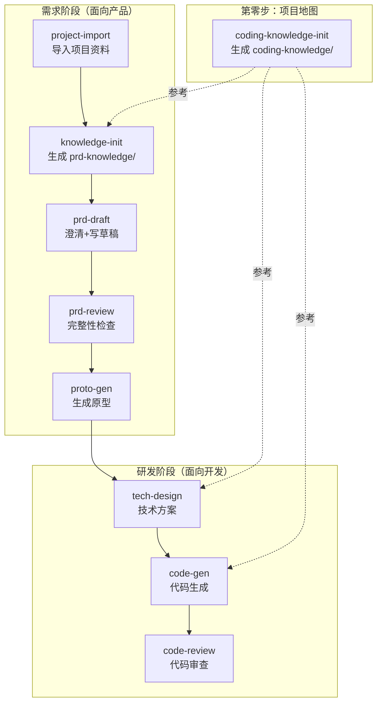

# C-ROOM

> 让 Claude Code 一条命令跑通「需求 → PRD → 原型 → 技术方案 → 代码 → 审查」全流程。

C-ROOM 是一套开箱即用的 Claude Code Skill 集合。安装后，你只需要用自然语言描述需求，AI 就能帮你完成从产品到研发的完整闭环。

## 安装

在 Claude Code 中输入以下任意一句话即可触发安装：

```
帮我安装 https://github.com/wuyining0130/c-room下的所有skill（首次安装）
更新 https://github.com/wuyining0130/c-room 所有 skill 到本地（更新到最新版）
把 github.com/wuyining0130/c-room 里的 skills 克隆到 ~/.claude/skills/
```

或者直接用脚本：

```bash
git clone https://github.com/wuyining0130/c-room.git /tmp/c-room && bash /tmp/c-room/install.sh && rm -rf /tmp/c-room
```

## 装完能干嘛

在 Claude Code 里直接说就行：

| 你说的话 | 触发的 Skill | AI 帮你做的事 |
|---------|-------------|-------------|
| "帮我了解一下这个项目" | `/knowledge-init` | 扫描代码和文档，生成结构化知识库 |
| "我要做一个新功能" | `/prd-draft` | 先问你 5-8 轮澄清问题，再输出 PRD |
| "看看这个 PRD 有没有问题" | `/prd-review` | 7 个维度逐项校验，输出分级报告 |
| "把 PRD 变成页面" | `/proto-gen` | 生成 HTML 高保真原型，双击即可预览 |
| "这个需求怎么实现" | `/tech-design` | 输出改动范围、接口设计、DDL、任务拆解 |
| "开始写代码" | `/code-gen` | 按依赖顺序生成完整业务代码 |
| "帮我看看这些改动" | `/code-review` | 四维度审查：需求覆盖、方案合规、代码质量、安全 |

## 全流程一览



## Skill 清单

| Skill | 一句话说明 |
|-------|----------|
| `conventions` | 全流程共享约定：目录规范、知识库结构、PRD 模板、问题分级 |
| `coding-knowledge-init` | 扫描多个代码仓库，生成三层分层技术知识库 |
| `project-import` | 粘贴链接，自动拉取项目资料 |
| `knowledge-init` | 扫描代码和文档，生成面向写 PRD 的知识库 |
| `prd-draft` | 引导式澄清 + 自动生成结构化 PRD |
| `prd-review` | 7 模块逐项校验 + 知识库交叉检查 |
| `proto-gen` | 基于 PRD 生成 B 端 HTML 高保真原型 |
| `tech-design` | 从 PRD 到技术方案：接口、DDL、任务拆解 |
| `code-gen` | 读取技术方案，按依赖顺序生成完整业务代码 |
| `code-review` | 需求覆盖 + 方案合规 + 代码质量 + 安全审查 |
| `tapd-sync` | 一键同步 Markdown 到 TAPD 需求单 |

## 目录结构

```text
c-room/
└── skills/
    ├── conventions/              # 共享约定
    ├── coding-knowledge-init/    # 编码知识库初始化
    ├── project-import/           # 项目资料导入
    ├── knowledge-init/           # PRD 知识库初始化
    ├── prd-draft/                # 需求草稿生成
    ├── prd-review/               # 需求完整性检查
    ├── proto-gen/                # 原型生成
    ├── tech-design/              # 技术方案生成
    ├── code-gen/                 # 代码生成
    ├── code-review/              # 代码审查
    └── tapd-sync/                # TAPD 同步
```

## 卸载

```bash
git clone https://github.com/wuyining0130/c-room.git /tmp/c-room && bash /tmp/c-room/uninstall.sh && rm -rf /tmp/c-room
```

或者在 Claude Code 中说：

```
帮我删除 c-room 安装的所有 skill
```

## License

MIT
