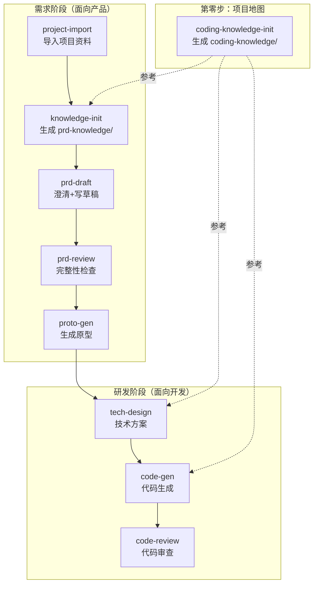

# C-ROOM

**用途**: 基于 Claude Code 的 AI 辅助需求-开发全流程 Skill 体系。覆盖从项目资料导入、知识库构建、PRD 生成、需求评审、原型生成、技术方案，到代码生成和代码审查的完整闭环。

---

## Skill 体系全景



**coding-knowledge 是地基**：先扫描代码仓库生成项目全景地图（架构、符号索引、调用链、DDL），后续所有 skill 都可以参考。
- `coding-knowledge/` — 代码架构、符号索引、调用链，是整个项目的技术地图
- `prd-knowledge/` — 业务语义、产品上下文，参考 coding-knowledge 生成，给写 PRD 用
- `tech-design` 是桥梁 — 同时读取两套知识库，把产品需求翻译为技术方案

---

## 快速上手

### 第零步：构建项目地图

**0. 生成编码知识库**
```
> /coding-knowledge-init
```
扫描多个代码仓库，生成 `coding-knowledge/` 三层分层知识库（基础技术层、业务层、代码仓库层）。这是整个项目的技术地图，后续所有 skill 都可参考。**一个项目只需执行一次**，代码架构有大变动时重新执行。

### 需求阶段（PRD 管线）

**1. 导入项目资料**
```
> /project-import
```
粘贴 TAPD 链接或 Git 仓库地址，自动拉取到 `sources/` 目录。

**2. 生成 PRD 知识库**
```
> /knowledge-init
```
扫描代码和需求文档，参考 `coding-knowledge/` 生成 `prd-knowledge/`（8 个结构化知识文件 + 完整性检查报告）。

**3. 写 PRD 草稿**
```
> /prd-draft
```
描述需求 → AI 先提 5-8 轮澄清问题 → 确认后生成结构化 PRD（7 模块标准结构）。

**4. PRD 评审**
```
> /prd-review
```
对 PRD 做 7 模块逐项校验 + 知识库交叉检查，输出分级报告（🔴阻塞 / 🟡建议 / 🔵提示）。修改后重跑直到阻塞清零。

**5. 生成原型**
```
> /proto-gen
```
基于 PRD 终稿生成 B 端 HTML 高保真原型，浏览器双击即可查看。

### 研发阶段（编码管线）

**6. 生成技术方案**
```
> /tech-design
```
基于 PRD + 原型 + 两套知识库，输出改动范围、接口设计（含请求/响应参数）、DDL、任务拆解。

**7. 生成代码**
```
> /code-gen
```
读取技术方案 + PRD + 原型 + 编码知识库，按依赖顺序（Entity → Mapper → Service → Controller → 前端组件）生成完整业务代码。生成前先展示计划，确认后才动手。

**8. 代码审查**
```
> /code-review
```
四维度审查：需求覆盖（PRD↔代码）、技术方案合规（tech-design↔代码）、代码质量（coding-knowledge↔代码）、安全与性能。输出分级报告。

### 辅助工具

**同步到 TAPD**
```
> /tapd-sync
```
将本地 Markdown 文档同步到 TAPD 需求单。

---

## Skill 清单

| Skill | 定位 | 输入 | 输出 |
|-------|------|------|------|
| `conventions` | 共享约定 | — | 目录规范、知识库结构、PRD 结构、问题分级、版本管理 |
| `coding-knowledge-init` | 项目地图（第零步） | 多个代码仓库 | `coding-knowledge/` |
| `project-import` | 资料导入 | TAPD 链接 / Git 地址 | `sources/` |
| `knowledge-init` | PRD 知识库 | `sources/` + `coding-knowledge/` | `prd-knowledge/` |
| `prd-draft` | 需求草稿 | 需求描述 + `prd-knowledge/` | `requirements/{模块}/prd-draft.md` |
| `prd-review` | 需求评审 | `prd-draft.md` + `prd-knowledge/` | `requirements/{模块}/review/` |
| `proto-gen` | 原型生成 | `prd-draft.md` + 前端代码 | `requirements/{模块}/prototype/` |
| `tech-design` | 技术方案 | PRD + 原型 + 两套知识库 + 后端代码 | `requirements/{模块}/tech-design.md` |
| `code-gen` | 代码生成 | tech-design + PRD + 原型 + `coding-knowledge/` | 代码变更 + `code-gen-report.md` |
| `code-review` | 代码审查 | 代码变更 + tech-design + PRD + `coding-knowledge/` | `requirements/{模块}/code-review/` |
| `tapd-sync` | TAPD 同步 | 本地 Markdown + TAPD 链接 | 更新 TAPD 需求单 |

---

## 目录结构

```text
c-room/
├── README.md
├── install.sh                             # Shell 安装脚本
├── uninstall.sh                           # Shell 卸载脚本
├── package.json                           # npm 包配置（支持 npx 安装）
├── bin/
│   └── install.js                         # Node.js 安装脚本
├── skills/                                # Skill 定义（Claude Code 版）
│   ├── conventions/                       # 共享约定（全流程）
│   ├── project-import/                    # 项目资料导入
│   ├── knowledge-init/                    # PRD 知识库初始化
│   ├── coding-knowledge-init/             # 编码知识库初始化
│   ├── prd-draft/                         # 需求草稿生成
│   ├── prd-review/                        # 需求完整性检查
│   ├── proto-gen/                         # 原型生成
│   ├── tech-design/                       # 技术方案生成
│   ├── code-gen/                          # 代码生成
│   ├── code-review/                       # 代码审查
│   └── tapd-sync/                         # TAPD 同步
├── skill-test/                            # Skill 全流程实测产出
│   ├── ai-knowledge/                      # knowledge-init 产出（待重命名为 prd-knowledge）
│   ├── requirements/
│   │   └── 坐席辅助知识库-FAQ管理/
│   │       ├── prd-draft.md               # PRD 草稿
│   │       ├── review/                    # 评审报告（7 模块）
│   │       ├── prototype/                 # HTML 高保真原型
│   │       └── tech-design.md             # 技术方案
│   └── sources/                           # 原始代码仓库（.gitignore 排除）
└── prompt-test/                           # 早期 prompt 直出实验产出
```

---

## 项目目录规范

使用 Skill 体系时，项目根目录的标准结构：

```text
{project_root}/
├── sources/                    # project-import 产出
├── prd-knowledge/              # knowledge-init 产出（面向写 PRD）
├── coding-knowledge/           # coding-knowledge-init 产出（面向写代码）
└── requirements/
    └── {模块名}/
        ├── prd-draft.md        # prd-draft 产出
        ├── review/             # prd-review 产出
        ├── prototype/          # proto-gen 产出
        ├── tech-design.md      # tech-design 产出
        ├── code-gen-report.md  # code-gen 产出
        └── code-review/        # code-review 产出
```

---

## 实测产出

以"坐席辅助知识库-FAQ管理"为实际需求，跑通 PRD 管线全流程：

| 环节 | 产出 | 规模 |
|------|------|------|
| knowledge-init | `ai-knowledge/`（9 个知识库文件） | 从 6 个代码仓库 + TAPD 需求提取 |
| prd-draft | `prd-draft.md` | 11 个功能点、含数据模型和权限矩阵 |
| prd-review | `review/`（8 份检查报告） | 7 模块逐项校验 + 总览报告 |
| proto-gen | `prototype/prototype.html` | 导航首页 + 列表页 + 表单页 + 6 个弹窗 |
| tech-design | `tech-design.md` | 4 个仓库、17 个接口、2 张新表、15 个任务项 |

### 按角色查找

**产品经理**：[prd-draft.md](./skill-test/requirements/坐席辅助知识库-FAQ管理/prd-draft.md) → [review-summary.md](./skill-test/requirements/坐席辅助知识库-FAQ管理/review/review-summary.md) → [prototype.html](./skill-test/requirements/坐席辅助知识库-FAQ管理/prototype/prototype.html)

**后端开发**：[tech-design.md](./skill-test/requirements/坐席辅助知识库-FAQ管理/tech-design.md) → [architecture.md](./skill-test/ai-knowledge/architecture.md) → [api-inventory.md](./skill-test/ai-knowledge/api-inventory.md)

**前端开发**：[prototype.html](./skill-test/requirements/坐席辅助知识库-FAQ管理/prototype/prototype.html) → [tech-design.md](./skill-test/requirements/坐席辅助知识库-FAQ管理/tech-design.md) → [design-patterns.md](./skill-test/ai-knowledge/design-patterns.md)

**测试**：[prd-draft.md](./skill-test/requirements/坐席辅助知识库-FAQ管理/prd-draft.md)（验收标准） → [tech-design.md](./skill-test/requirements/坐席辅助知识库-FAQ管理/tech-design.md)（接口参数/错误码）

---

## 安装

```bash
npx c-room
```

更新到最新版本时再跑一次即可。

### 卸载

```bash
npx c-room --uninstall
```

安装后在 Claude Code 中使用 `/skill-name` 调用对应 Skill。建议按照"快速上手"章节的顺序首次使用。每个 Skill 都可独立使用，但完整走一遍效果最好。
