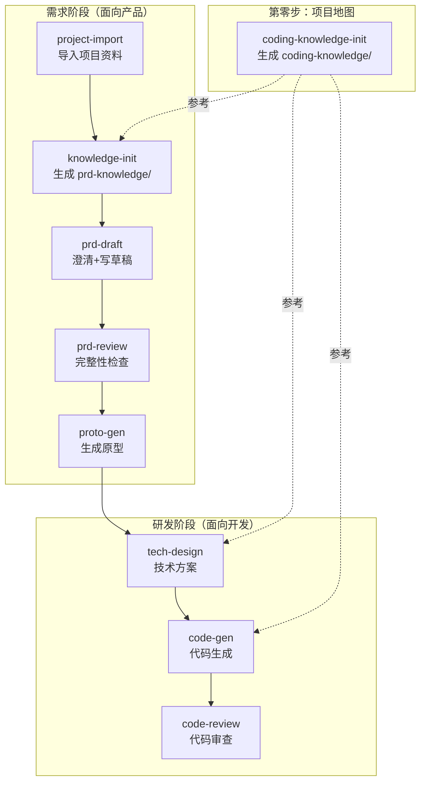

# C-ROOM

> 让 Claude Code 一条命令跑通「需求 → PRD → 原型 → 技术方案 → 代码 → 审查」全流程。

C-ROOM 是一套开箱即用的 Claude Code Skill 集合。安装后，你只需要用自然语言描述需求，AI 就能帮你完成从产品到研发的完整闭环。

## 解决什么问题

AI Coding 的瓶颈不在"AI 能不能写好代码"，而在**每次都要从头交代项目背景**。

业务流程在产品脑子里，系统架构在开发脑子里，调用关系在代码注释里。每次和 AI 协作都要手动拼上下文，效率全靠人肉手艺。

C-ROOM 做的事：**把专家知识一次性结构化沉淀，之后全链路自动加载。**

| 没有 C-ROOM | 有 C-ROOM |
|-------------|----------|
| 改代码前在 10+ 个仓库 grep 半小时找目标方法 | 几秒定位到方法签名和行号 |
| 写 PRD 时 AI 编造系统现状，交付后反复改 | 先问 5-8 轮澄清问题，基于真实系统状态生成 |
| 技术方案遗漏跨服务影响，上线后才发现 | 自动追踪调用链，列出所有受影响的服务 |
| 每次对话重新交代项目背景 | 知识沉淀一次，每个环节自动加载 |

## 适用场景

- **多仓库微服务项目**（最佳场景）：Java/Spring、Go、PHP、Python、Node.js、Vue/React
- **单仓库项目**也可以用，只是跨服务相关的能力用不上
- **技术栈要求**：需要安装 [Claude Code](https://docs.anthropic.com/en/docs/claude-code)

## 安装

```bash
git clone https://github.com/wuyining0130/c-room.git /tmp/c-room && bash /tmp/c-room/install.sh && rm -rf /tmp/c-room
```

或者在 Claude Code 对话中说：

```
帮我安装 https://github.com/wuyining0130/c-room 下的所有 skill
```

更新到最新版：

```
更新 https://github.com/wuyining0130/c-room 所有 skill 到本地
```

## Quick Start

安装完成后，在你的项目目录下打开 Claude Code，试试：

**第一步：建立知识库**（只需做一次）

告诉 AI 你的仓库信息：

```
帮我初始化编码知识库。仓库信息如下：

模块    子模块    服务           本地路径                 服务描述
交易    订单      order-srv     ~/repos/order-srv       订单服务
                  pay-srv       ~/repos/pay-srv         支付服务
        履约      fulfill-srv   ~/repos/fulfill-srv     履约服务
```

AI 会自动扫描代码、生成三层知识库（基础技术层 → 业务层 → 代码仓库层），大约 15 分钟。

**第二步：开始使用**

知识库建好后，后续所有操作都会自动加载项目上下文：

```
我要做一个新功能：用户可以批量导出订单
```

AI 会先问你澄清问题（范围、角色、流程），然后生成 PRD，接着可以继续走技术方案、代码生成、code review。

## 项目 Studio 是什么

C-ROOM 的所有 skill 围绕一个**项目 Studio** 工作——一个专属于你的业务模块的本地工作目录，所有知识库、需求文档、技术方案、原型都集中在这里。

### 建立 Studio

```
mkdir my-project && cd my-project
```

在这个目录下打开 Claude Code，按顺序执行：

1. **建立编码知识库**（第零步，只需做一次）
   ```
   帮我初始化编码知识库。仓库信息如下：
   模块    子模块    服务           本地路径              服务描述
   交易    订单      order-srv     ~/repos/order-srv    订单服务
                     pay-srv       ~/repos/pay-srv      支付服务
   ```
   产出：`coding-knowledge/` — 三层分层技术知识库。建好后，后续写 PRD、写技术方案、生成代码都会自动加载。

2. **开始做需求**（可反复执行，每个需求独立目录）
   ```
   我要做一个新功能：用户可以批量导出订单
   ```
   产出：`requirements/批量导出/` — PRD、原型、技术方案、代码审查报告

> **补充说明**：`project-import` 和 `knowledge-init` 两个 skill 面向没有完整编码知识库的场景——比如你接手一个陌生项目，需要先导入资料、生成面向写 PRD 的知识库。如果你已经有了 `coding-knowledge/`，可以跳过这两步，直接从写需求开始。

### Studio 最终目录结构

```
my-project/                              # 项目 Studio 根目录
├── CLAUDE.md                            # AI 编码指引（自动生成）
│
├── coding-knowledge/                    # coding-knowledge-init 产出
│   ├── INDEX.md                         # 顶层入口（含意图路由表）
│   ├── config.yaml                      # 项目配置
│   ├── knowledge-gaps.md                # 知识缺口报告
│   ├── infra/                           # 基础技术层（技术栈、中间件、分层规范）
│   ├── business/                        # 业务层（术语表、架构、业务域、PRD参考）
│   └── repos/                           # 代码仓库层（每个仓库的架构/符号/调用链/表结构）
│
├── prd-knowledge/                       # knowledge-init 产出（可选，无编码知识库时使用）
│   ├── business-context.md              # 业务上下文
│   ├── user-roles.md                    # 用户角色
│   ├── existing-features.md             # 现有功能
│   └── ...
│
├── repos/                               # 业务代码仓库（git clone 或软链接）
│   ├── order-srv/
│   ├── pay-srv/
│   └── ...
│
└── requirements/                        # 每个需求独立目录
    ├── 批量导出/
    │   ├── prd-draft.md                 # PRD 草稿
    │   ├── prd-context.md               # 需求上下文（跨会话记忆）
    │   ├── review/                      # PRD 审查报告
    │   ├── prototype/                   # HTML 高保真原型
    │   ├── tech-design.md               # 技术方案
    │   ├── code-gen-report.md           # 代码生成报告
    │   └── code-review/                 # 代码审查报告
    └── 权限管理/
        └── ...                          # 同上结构
```

知识库只需建一次，之后每个需求都会自动加载项目上下文，不用重复交代背景。

## 装完能干嘛

在 Claude Code 里直接说就行：

| 你说的话 | 触发的 Skill | AI 帮你做的事 |
|---------|-------------|-------------|
| "帮我了解一下这个项目" | `knowledge-init` | 扫描代码和文档，生成结构化知识库 |
| "我要做一个新功能" | `prd-draft` | 先问你 5-8 轮澄清问题，再输出 PRD |
| "看看这个 PRD 有没有问题" | `prd-review` | 7 个维度逐项校验，输出分级报告 |
| "把 PRD 变成页面" | `proto-gen` | 生成 HTML 高保真原型，双击即可预览 |
| "这个需求怎么实现" | `tech-design` | 输出改动范围、接口设计、DDL、任务拆解 |
| "开始写代码" | `code-gen` | 按依赖顺序生成完整业务代码 |
| "帮我看看这些改动" | `code-review` | 四维度审查：需求覆盖、方案合规、代码质量、安全 |

## 全流程一览



## Skill 清单

| Skill | 一句话说明 |
|-------|----------|
| `conventions` | 全流程共享约定：目录规范、知识库结构、PRD 模板、问题分级 |
| `coding-knowledge-init` | 扫描多个代码仓库，生成三层分层技术知识库 |
| `project-import` | 粘贴链接，自动拉取项目资料 |
| `knowledge-init` | 扫描代码和文档，生成面向写 PRD 的知识库 |
| `prd-draft` | 引导式澄清 + 自动生成结构化 PRD |
| `prd-review` | 7 模块逐项校验 + 知识库交叉检查 |
| `proto-gen` | 基于 PRD 生成 B 端 HTML 高保真原型 |
| `tech-design` | 从 PRD 到技术方案：接口、DDL、任务拆解 |
| `code-gen` | 读取技术方案，按依赖顺序生成完整业务代码 |
| `code-review` | 需求覆盖 + 方案合规 + 代码质量 + 安全审查 |
| `tapd-sync` | 一键同步 Markdown 到 TAPD 需求单 |

## 目录结构

```text
c-room/
└── skills/
    ├── conventions/              # 共享约定
    ├── coding-knowledge-init/    # 编码知识库初始化
    ├── project-import/           # 项目资料导入
    ├── knowledge-init/           # PRD 知识库初始化
    ├── prd-draft/                # 需求草稿生成
    ├── prd-review/               # 需求完整性检查
    ├── proto-gen/                # 原型生成
    ├── tech-design/              # 技术方案生成
    ├── code-gen/                 # 代码生成
    ├── code-review/              # 代码审查
    └── tapd-sync/                # TAPD 同步
```

## 卸载

```bash
git clone https://github.com/wuyining0130/c-room.git /tmp/c-room && bash /tmp/c-room/uninstall.sh && rm -rf /tmp/c-room
```

或者在 Claude Code 中说：

```
帮我删除 c-room 安装的所有 skill
```

## License

MIT
