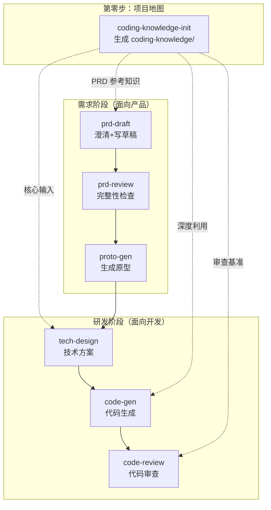

## Purpose

这是整套 AI 辅助需求-开发工作流的"宪法"——集中定义所有 skill 共享的约定，确保整条流水线的输入输出能正确对接。

各 skill 不再各自定义这些规范，而是引用本 skill。如果约定需要调整，改这一个地方就行。

## 工作流全景



**三个阶段**：

- **第零步（项目地图）**：`coding-knowledge-init` 扫描代码仓库生成 `coding-knowledge/`，是整个体系的地基。一个项目只需执行一次，代码架构有大变动时重新执行。
- **需求阶段（PRD 管线）**：从需求描述到原型，面向产品需求分析。`prd-draft` → `prd-review` → `proto-gen` 线性推进。
- **研发阶段（编码管线）**：从技术方案到代码实现再到代码审查，面向开发落地。

**coding-knowledge 是地基**：

`coding-knowledge/` 贯穿整个体系，不是某个阶段的专属工具：
- `prd-draft` 读取 `business/system-overview.md` + `business-flows.md` + `glossary.md` 理解现有系统，生成更精准的澄清问题
- `tech-design` 以它为核心输入做改动范围定位和接口设计
- `code-gen` 深度利用它学习项目编码模式，生成风格一致的代码
- `code-review` 以它为审查基准，用项目标准（而非通用最佳实践）审查代码

---

## 1. 项目根目录

**项目根目录**是 `{project_name}/` 目录。所有 skill 的输入/输出路径都相对于此目录。

判断优先级：
1. 如果当前工作目录下存在 `coding-knowledge/` 目录 → 当前目录即为项目根目录
2. 如果当前工作目录下存在 `requirements/` 目录 → 当前目录即为项目根目录
3. 否则 → 使用当前工作目录

---

## 2. PRD 文档结构

先读取 YAML frontmatter 的 `mode`，再选择结构，禁止混用：

- `mode: standard`（或旧文档未声明 mode）：按下列标准结构检查。
- `mode: mini`：仅保留“一、需求背景”和“二、需求详情”，功能点使用 `F-XX`；不得为了满足标准结构补功能清单、流程、权限、待确认项或默认假设。只有需求范围小、无跨系统流程、无权限变化、无复杂状态流转且无待确认阻塞时才能使用 mini；任一条件不满足即升级为 standard。

standard PRD 遵循以下 7 模块结构：

| 编号 | 模块 | 内容 | 是否必需 |
|------|------|------|----------|
| 一 | 需求背景 | 1.1 背景与目标；1.2 本期范围与排除边界 | 是 |
| 二 | 功能清单 | F-XX 产品能力索引、场景简介、优先级 | 是 |
| 三 | 业务流程图 | 核心端到端流程、角色/系统边界、异常分支 | 有流程时 |
| 四 | 需求详情 | 每个 F-XX 的功能描述、按需交互/规则/错误/数据定义、验收标准 | 是 |
| 五 | 权限管理 | 角色权限矩阵、数据权限、与现有权限体系的关系 | 涉及权限时 |
| 六 | 待确认项 | 未确认问题、影响范围、建议方案 | 有待确认项时 |
| 七 | 默认假设 | 未明确讨论但采用的假设及依据 | 有默认假设时 |

数据模型不设独立一级章。新实体或字段只在对应 F-XX 的“数据定义”中出现一次；不涉及新数据实体时省略。交互说明、业务规则与边界、错误处理也按需保留，不得为了模板完整写“无”或重复其他小节。

**PRD 产品导向原则**：PRD 面向业务方，全篇使用产品语言。禁止出现类名、方法名、表名、代码字段名等实现细节。内部去重编号不得暴露到正文。

---

## 3. coding-knowledge/ 标准文件清单

`coding-knowledge-init` 生成的编码知识库目录，位于项目根目录下，是整个体系的技术地基：

```
coding-knowledge/
├── config.yaml                       # 项目配置：业务名称、子模块、仓库映射
├── scan-baseline.yaml                # 各仓库最近成功扫描的 commit、时间和脏工作区状态
├── INDEX.md                          # 顶层索引：三层知识概览和导航
├── infra/                            # 第1层：基础技术层
│   ├── INDEX.md
│   ├── tech-stack.md                 # 技术栈规范
│   ├── middleware.md                 # 基础设施与中间件规范
│   ├── app-architecture.md           # 应用选型与分层规范
│   ├── code-quality.md               # 代码质量规范
│   ├── cicd.md                       # CI/CD 平台与流程
│   └── security.md                   # 安全合规规范
├── business/                         # 第2层：业务层
│   ├── INDEX.md
│   ├── overall-architecture.md       # 整体业务架构与服务拓扑（含上游系统、核心调用关系明细）
│   ├── glossary.md                   # 业务术语表
│   ├── system-overview.md            # 功能清单 + 运营后台交互模式 + 角色与权限
│   ├── business-flows.md             # 核心业务流程
│   ├── data-model.md                 # 核心数据关系模型
│   ├── faq.md                        # 业务常见问题
│   └── domains/                      # 细分业务架构
│       └── {domain-name}/
│           └── overview.md           # 领域概述、核心流程
├── repos/                            # 第3层：代码仓库层
│   ├── INDEX.md                      # 仓库层索引（含场景→模块路由表）
│   └── {repo-name}/
│       ├── architecture.md           # 仓库代码架构（含职责边界）
│       ├── codebase-index.md         # 代码索引
│       ├── symbols.md               # 关键类/方法/接口签名索引
│       ├── database-schema.md        # 数据库表结构
│       └── call-chains.md            # 核心业务调用链
└── knowledge-gaps.md                 # 知识完整性检查报告（含质量评分卡）
```

| 层 | 核心文件 | 下游 skill 如何使用 |
|----|---------|---------------------|
| infra | `code-quality.md` | code-gen/code-review：全局编码规范基准 |
| business | `glossary.md`, `overall-architecture.md` | tech-design：跨服务调用关系（overall-architecture 核心调用关系明细）；prd-draft：业务语义参考 |
| repos | `symbols.md` | tech-design：精确定位代码位置；code-gen：风格学习入口；code-review：审查参考 |
| repos | `architecture.md` | tech-design：判断功能归属和职责边界；code-gen：确定新文件包路径 |
| repos | `database-schema.md` | tech-design：参考建表风格；code-gen：复刻字段命名规范 |
| repos | `call-chains.md` | tech-design：追踪调用链完整性；code-gen：学习跨服务调用方式；code-review：验证调用模式一致性 |

---

## 3.5 PRD 参考知识路径

需求阶段的 skill（prd-draft、prd-review、proto-gen）加载 PRD 参考知识时，统一从 `coding-knowledge/business/` 读取。

核心文件：`system-overview.md`（功能清单+交互模式+角色权限）、`business-flows.md`、`glossary.md`、`data-model.md`。

---

## 5. requirements/{模块名}/ 目录规范

每个业务模块（需求）在项目根目录下的 `requirements/` 中拥有独立目录。模块名由 prd-draft 在澄清阶段与用户确认，也可以理解为需求名称。

```
{project_root}/
├── coding-knowledge/                 # coding-knowledge-init 产出（第零步）
└── requirements/
    └── {模块名}/                     # 如"知识管理"、"FAQ管理"
        ├── prd-draft.md              # prd-draft 产出
        ├── prd-context.md            # 需求决策基线（prd-draft 自动维护）
        ├── review/                   # prd-review 产出
        │   ├── review-summary.md     # 唯一必需报告，完整汇总所有发现
        │   └── {检查维度}.md          # 可选；内容较多时拆分
        ├── prototype/               # proto-gen 产出
        │   └── {模块名}.html          # 单文件自包含原型
        ├── tech-design.md            # tech-design 产出
        ├── code-gen-report.md        # code-gen 产出
        ├── tapd-backup/              # tapd-sync 本地运行时备份（建议加入 .gitignore）
        │   ├── {story_id}-{timestamp}.json
        │   └── {story_id}-{timestamp}-preview.html
        └── code-review/              # code-review 产出
            ├── review-summary.md     # 总览报告
            └── {仓库名}.md           # 按仓库的详细报告
```

---

## 6. 各 skill 输入/输出路径汇总

### 第零步

| Skill | 输入 | 输出 | 说明 |
|-------|------|------|------|
| coding-knowledge-init | 多个代码仓库路径 | `{project_root}/coding-knowledge/` | 项目技术地基，一个项目只需执行一次 |

### 需求阶段

| Skill | 输入 | 输出 |
|-------|------|------|
| prd-draft | 用户需求描述 + `coding-knowledge/`(如有) | `requirements/{模块名}/prd-draft.md` + `prd-context.md` |
| prd-review | `requirements/{模块名}/prd-draft.md` + `prd-context.md` + `coding-knowledge/`(如有) | `requirements/{模块名}/review/review-summary.md` |
| proto-gen | `requirements/{模块名}/prd-draft.md` + 前端代码 | `requirements/{模块名}/prototype/{模块名}.html` |

### 研发阶段

| Skill | 输入 | 输出 |
|-------|------|------|
| tech-design | `prd-draft.md` + `prototype/` + `coding-knowledge/` + 后端代码 | `requirements/{模块名}/tech-design.md` |
| code-gen | `tech-design.md` + `prd-draft.md` + `prototype/` + `coding-knowledge/` + 源码仓库 | 代码变更 + `requirements/{模块名}/code-gen-report.md` |
| code-review | 代码变更 + `tech-design.md` + `prd-draft.md` + `coding-knowledge/` | `requirements/{模块名}/code-review/` |

### 辅助工具

| Skill | 输入 | 输出 |
|-------|------|------|
| tapd-sync | 本地 Markdown + TAPD 链接 | 更新 TAPD 需求单 |

---

## 7. coding-knowledge 在研发阶段的统一使用策略

研发阶段三个 skill（tech-design、code-gen、code-review）对 coding-knowledge 的使用策略一脉相承：

### 三层读取策略（三个 skill 统一）

```
第一层：infra/（全局标准）
  → code-quality.md、middleware 规范等

第二层：repos/{repo}/（按涉及仓库读取）
  → architecture.md、symbols.md、database-schema.md、call-chains.md

第三层：business/domains/{domain}/（按需读取）
  → overview.md（业务流程和职责分工）
```

### 各 skill 的侧重点

| 策略 | tech-design | code-gen | code-review |
|------|------------|---------|-------------|
| symbols.md | **定位**：找到需要修改的类和方法 | **学习**：找同类型参考文件，Read 完整源码学习编码模式 | **对照**：找同类型参考文件作为"好代码的参考答案" |
| architecture.md | 判断功能归属和职责边界 | 确定新文件放在哪个包 | 检查代码是否放在正确的层/包 |
| database-schema.md | 参考建表风格设计 DDL | 复刻字段命名规范生成 Entity | 检查索引完整性和命名一致性 |
| call-chains.md | 追踪完整调用链，杜绝遗漏 | 学习跨服务调用的实际写法 | 验证调用方式是否与现有模式一致 |
| code-quality.md | — | 遵守编码规范生成代码 | 作为代码质量检查的基准 |

### 核心原则

- **标准从项目中来**：不用通用最佳实践替代项目的实际编码模式
- **风格对照而非风格发明**：如果整个项目都用 `@Autowired`，新代码用 `@Autowired` 就不是问题
- **知识库不是需求权威源**：coding-knowledge 描述现状，不能覆盖用户确认的新需求

## 7.5 权威来源与冲突处理

不同信息使用不同权威源，禁止用一个笼统优先级处理所有冲突：

| 信息类型 | 权威顺序 |
|----------|----------|
| 需求意图与业务决策 | 用户当前明确指示 > prd-context 最新决策 > PRD 正文 |
| 页面与交互 | PRD > 经用户确认且已同步的原型；原型未同步差异只作为待处理项 |
| 系统现状、代码结构、接口签名 | 当前源码 > 最新扫描的 coding-knowledge > 历史技术文档 |
| 实施方案 | 已确认且与 PRD/源码一致的 tech-design；它不能覆盖上游需求 |

发现冲突时先判断信息类型，再处理：

1. 可从源码或文件版本客观验证的，先验证并使用最新事实，同时更新过期知识库或方案。
2. 会改变业务行为、页面范围、接口契约或数据口径的，停止下游写入，列出冲突并请用户确认或先修正上游文档。
3. code-gen 不得明知 tech-design 与 PRD、原型或源码矛盾仍继续实现。
4. 所有下游产物记录所依据的上游文件路径和版本，便于检测过期。

---

## 8. PRD 版本管理

prd-draft 在 YAML frontmatter 中标注 `version: "draft-v1"`。每次修改必须递增版本并追加变更记录；prd-review 和 tech-design 必须记录所读取的 PRD 版本。

典型迭代流程：
```
prd-draft → draft-v1 → prd-review(v1) → 修复阻塞 → draft-v2 → prd-review(v2) → 通过 → proto-gen
```

---

## 9. 问题分级标准（全局统一）

prd-review、code-review 共用同一套三级分级体系：

| 级别 | 含义 | 示例 |
|------|------|------|
| 🔴 阻塞 | 不修复不能通过 | 安全漏洞、需求功能遗漏、接口参数不一致 |
| 🟡 建议 | 建议修复但不阻塞 | 与项目风格不一致、缺少必要注释、性能隐患 |
| 🔵 提示 | 优化建议 | 可选的代码重构、更优雅的实现方式 |

---

## 10. 快速上手指南

**第一次使用整套流程：**

**第零步：构建项目地图**
0. `coding-knowledge-init` — 扫描代码仓库，生成 `coding-knowledge/` 编码知识库。这是整个体系的地基，建议最先执行。

**需求阶段（PRD 管线）：**
1. `prd-draft` — 描述你的需求，AI 先澄清模糊点再生成 PRD 草稿
2. `prd-review` — 检查草稿完整性，按阻塞/建议/提示分级
3. 修改 PRD → 重跑 `prd-review` → 直到阻塞清零
4. `proto-gen` — 基于 PRD 终稿生成 HTML 原型

**研发阶段（编码管线）：**
5. `tech-design` — 基于 PRD + 原型 + 编码知识库生成技术方案（改动范围、接口设计、DDL、任务拆解）
6. `code-gen` — 基于技术方案 + PRD + 原型 + 编码知识库，在目标仓库中生成完整业务代码
7. `code-review` — 四维度审查：需求覆盖、技术方案合规、代码质量、安全与性能
8. `tapd-sync` — 将 PRD 或技术方案同步到 TAPD 需求单

**简化路径：** 没有 `coding-knowledge/` 也能用。`prd-draft` 会正常工作，只是澄清问题会更泛化、无法自动引用现有系统信息。最小可用路径：直接运行 `prd-draft` → `prd-review` → `proto-gen`。

**只用其中一个 skill：** 每个 skill 都可以独立使用，只是没有知识库时分析精度会下降。

---

## 10.5 CLAUDE.md 管理

以下 skill 会写入或更新项目根目录的 CLAUDE.md：

| Skill | 写入内容 | 触发条件 |
|-------|---------|---------|
| coding-knowledge-init | AI Coding 知识库使用指引 | 知识库生成/更新后 |
| prd-draft | PRD 文件守护规则 | 首次生成 PRD 后 |

写入规则：
- 各 skill 只管理自己的 section，不删除其他 skill 写入的内容
- 用 `## {Section 标题}` 作为 section 边界标识
- 写入前先 Read CLAUDE.md 检查是否已有该 section，有则更新，无则追加
