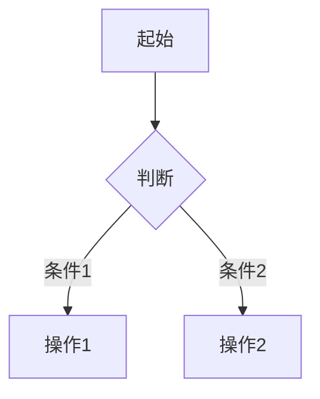
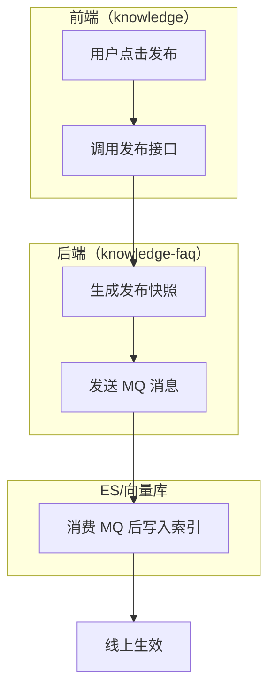

---
# PRD 核心信息（YAML frontmatter，方便下游 AI 解析）
title: "{需求标题}"
module: "{所属模块}"
version: "draft-v1"
date: "{生成日期}"
status: "draft"
roles:
  - name: "{角色名}"
    permissions: ["{权限1}", "{权限2}"]
core_entities:
  - name: "{业务概念名称，如'签章策略'而非'ESealStrategy'}"
    key_fields: ["{业务属性，如'签章类型'而非'FstrSealType'}"]
    relations: ["{业务关联，如'关联合同模板'}"]
priority: "{P0/P1/P2}"
dependencies:
  - "{依赖的现有功能或模块}"
---

# {需求标题}

# 一、需求背景

## 1.1 背景与目标

**背景：**
- {背景点 1：谁提出的，什么场景触发的}
- {背景点 2：当前的痛点}
- {背景点 3：现状问题}

**目标与收益：**
- {目标收益 1：做成后用户/业务状态发生什么变化，并说明核心受益角色，不写交付物名称}
- {目标收益 2：解决什么核心痛点，不复述 1.2 的本次包含}

## 1.2 需求范围

**本次包含：**
1. {能力边界 1：本期覆盖的业务能力域，不复制 F-XX 功能名}
2. {能力边界 2：本期覆盖的业务边界，不复述 1.1 目标}

**本次不含：**
1. {排除项 1}

# 二、功能清单

| 编号 | 功能名称 | 描述 | 优先级 |
|------|----------|------|--------|
| F-01 | {功能名} | {使用场景 + 一句话简介，与需求详情中的功能描述区分：这里侧重"谁在什么场景下用"} | P0 |
| F-02 | {功能名} | {使用场景 + 一句话简介} | P1 |

> 各功能的详细交互说明、验收标准等见第四章需求详情。

# 三、业务流程图

> 仅在存在需要表达的多步骤、跨角色或状态流转时保留本章；简单单步功能删除本章并顺延后续章节编号。

{使用 Mermaid 语法绘制核心流程。如果流程涉及多个系统/服务/角色，使用泳道图（subgraph）按系统拆分，而不是简单的 flowchart。}

**单系统流程示例：**



**跨系统泳道图示例（涉及多个系统时必须使用此格式）：**



**异常分支：** {异常路径说明，每个判断节点至少两个分支}

# 四、需求详情

## 4.1 F-01: {功能名称}

**功能描述：** {一句话概括用户/系统获得的核心能力，只回答“能做什么、产生什么业务结果”；不写操作步骤、字段限制、异常提示或验收口径}

**交互说明：**
1. {页面布局描述}
2. {操作流程描述}
3. {反馈方式描述}

**交互流程：**（涉及多步骤交互时必须补充）

> 当功能包含多步操作（如分步表单、弹窗确认链、状态流转等），用步骤列表或 Mermaid 图说明完整的交互序列，
> 包括每一步的触发条件、页面跳转/弹窗行为。失败分支只写简短场景名；提示文案和恢复方式统一写在错误处理中。

```
步骤 1: {用户操作} → {页面响应}
步骤 2: {用户操作} → {页面响应}
  ├─ 成功 → {下一步}
  └─ 保存失败 → 见错误处理
步骤 3: ...
```

**业务规则与边界：**（仅存在正常业务限制时保留）
1. {最大值、最小值、空值、唯一性、适用范围或状态限制}

**错误处理：**（仅存在需要单独说明的失败反馈或恢复方式时保留；用场景名称承接规则，不复制整条规则）
1. {简短错误场景}：提示“{具体文案}”，并{保留输入/回滚/重试等恢复方式}

**验收标准：**
1. {给出测试场景、关键操作和可观察结果；可包含理解该条所需的最少上下文，但不重新讲一遍完整规则或流程}
2. {异常验收仅写触发场景和预期反馈，不复制完整提示文案；具体文案见错误处理}

> 若业务规则与边界或错误处理没有独立信息，删除对应小节，不写“无”“不涉及”或为填充模板而改写其他小节。最终文档不得出现 I-XX、B-XX、E-XX、AC-XX 等内部写作编号。

**数据定义：**（该功能涉及新数据实体时补充）

> 数据模型使用业务概念命名，不使用代码类名或数据库表名。
> 技术落地时的具体表结构、字段映射由 tech-design 阶段确定。

| 属性 | 类型 | 必填 | 说明 | 约束 |
|------|------|------|------|------|
| {业务属性名} | {类型} | {是/否} | {业务含义说明} | {业务规则约束} |

# 五、权限管理

> 仅在本需求涉及角色权限或数据权限变化时保留本章；完全沿用且无需说明时可省略。

## 5.1 角色权限矩阵

| 功能 | {角色1} | {角色2} | {角色3} |
|------|---------|---------|---------|
| {功能1} | 查看/编辑 | 查看 | 无 |
| {功能2} | 全部 | 查看/编辑 | 查看 |

## 5.2 数据权限
{数据可见范围说明}

## 5.3 与现有权限体系的关系
{引用知识库 system-overview.md 的"角色与权限"章节，说明兼容情况}

---

# 六、待确认项

> 没有待确认项时删除本章。

以下问题在澄清阶段未能完全确认，需要后续与相关方讨论后补充：

| 编号 | 问题 | 影响范围 | 建议 |
|------|------|----------|------|
| Q-01 | {待确认问题} | {影响哪些功能} | {默认处理建议} |
| Q-02 | {待确认问题} | {影响哪些功能} | {默认处理建议} |

---

# 七、默认假设

> 没有默认假设时删除本章。

以下内容未在澄清中明确讨论，按常见做法处理。如有异议请标注：

| 编号 | 假设内容 | 依据 |
|------|----------|------|
| A-01 | {假设内容} | {知识库参考/行业惯例} |
