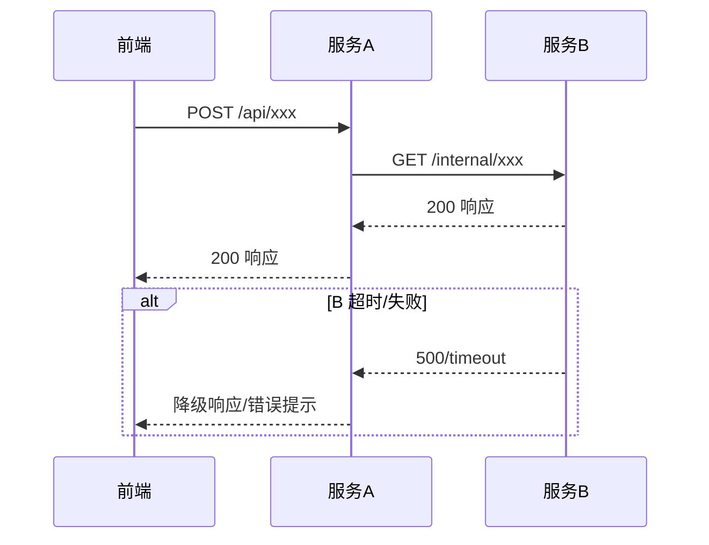

```markdown
---
title: "{模块名} — 技术方案"
version: "tech-v1"
prd_version: "{PRD 版本号}"
prd_path: "{PRD 文件路径}"
prd_review_path: "{review/review-summary.md 路径；mini 模式为 null}"
prototype_path: "{prototype/{模块名}.html 路径；纯后端为 null}"
prototype_prd_version: "{原型记录的 PRD 版本；不适用为 null}"
knowledge_baseline:
  {repo}: "{last_scanned_commit 或 source-verified}"
date: "{生成日期}"
status: "draft"
---

# {模块名} — 技术方案

## 1. 概述

### 1.1 需求摘要
{从 PRD 提取的一段话概括，说清楚这个需求要做什么}

**PRD 链接**：{PRD 文件路径或 TAPD 需求链接}

### 1.2 技术栈
{从 coding-knowledge 的 architecture.md 提取，列出本次改动涉及的技术组件}

## 2. 改动影响范围

### 2.1 总览

| 仓库 | 类型 | 改动内容 | 工作量评估 |
|------|------|----------|-----------|
| {仓库名} | {前端/后端} | {改动概要} | {S/M/L} |

### 2.2 详细改动清单

#### {仓库名}

- **新增**：{新增的文件/类/接口，从 architecture.md 推导的精确包路径}
- **修改**：{从 symbols.md 定位的文件路径:行号，具体修改的方法}
- **配置**：{配置变更，如新增 MQ Topic、权限菜单等}

### 2.3 交互时序图

对涉及多服务交互的链路，使用 Mermaid sequenceDiagram 绘制时序图。
基于 call-chains.md 中的实际调用关系绘制，而非从架构图推断。

至少覆盖以下场景：
1. 前端 → 后端 CRUD 主链路
2. 发布/同步链路（含 MQ、ES 等异步环节），标注失败分支
3. 跨服务查询链路（标注每一跳的服务名和接口路径）

每个时序图必须标注：
- 正常路径（实线箭头）
- 失败/超时分支（虚线箭头 + alt/opt 块）
- 异步操作（async 标注）



### 2.4 部署顺序
{多服务改动时的部署先后顺序及原因}

## 3. 接口设计

### 3.1 接口清单

| 编号 | 方法 | 路径 | 所属服务 | 说明 | 对应功能 |
|------|------|------|----------|------|----------|
| API-01 | POST | /xxx | {服务} | {说明} | F-01 |

### 3.2 接口详情（修改和新增接口）

#### API-01: {接口名称}

**{METHOD} {URL}**

> 对应功能：{PRD 功能编号}
> 所属服务：{仓库名}
> 代码定位：{从 symbols.md 获取的类名:方法名，新增则标注目标包路径}

**请求参数：**

| 参数 | 位置 | 类型 | 必填 | 说明 | 约束 |
|------|------|------|------|------|------|
| {name} | Path/Query/Body | String | 是 | {说明} | {长度/范围/枚举值/正则等约束} |

**请求示例：**

```json
{
  "field1": "value1",
  "field2": 123
}
```

**响应结构：**

| 字段 | 类型 | 说明 |
|------|------|------|
| code | int | 业务状态码，0 表示成功 |
| message | String | 状态描述 |
| data | Object | 业务数据 |
| data.{field} | {type} | {说明} |

**响应示例：**

```json
{
  "code": 0,
  "message": "success",
  "data": {
    "field1": "value1",
    "field2": 123
  }
}
```

**错误码：**

| code | message | 触发场景 | 前端处理建议 |
|------|---------|----------|-------------|
| {code} | {msg} | {什么条件下返回} | {Toast 提示/弹窗确认/阻断操作} |

### 3.3 复用接口参数说明

对标注"复用"的接口，必须说明以下信息：

| 接口编号 | 类型区分参数 | 传入位置 | 是否必填 | 新类型下的行为差异 |
|----------|------------|----------|----------|-------------------|
| API-XX | knowledgeType | Body/Query | 是/否 | 与原类型完全一致 / {差异说明} |

## 4. 数据库变更

### 4.1 新增表

```sql
-- 参考 database-schema.md 中 {参考表名} 的建表风格
CREATE TABLE `{table_name}` (
  `id` bigint(20) NOT NULL AUTO_INCREMENT COMMENT '主键',
  -- ...
  PRIMARY KEY (`id`),
  KEY `idx_xxx` (`xxx`)
) ENGINE=InnoDB DEFAULT CHARSET=utf8mb4 COMMENT='{表注释}';
```

### 4.2 修改表

```sql
ALTER TABLE `{table_name}`
  ADD COLUMN `{col}` {type} DEFAULT {default} COMMENT '{注释}';
```

### 4.3 数据迁移
{如需要}

## 5. 方案选型
{仅在存在有意义的多选方案时输出}

## 6. 非功能性考虑

### 6.1 性能
{列表数据量评估、是否需要索引优化、缓存策略}
注意：如果存在“建议确认”等模糊措辞，必须要么给出明确技术结论，要么转入第 9 节待确认项。正文中不得保留开放式结论。

### 6.2 兼容性与回滚方案
{与现有功能的兼容、灰度方案}

**回滚方案**（按部署逆序列出每个服务的回滚步骤）：
1. {最后部署的服务} — 回滚操作 + 配置还原说明
2. {倒数第二个服务} — 回滚操作
- 数据库：新增表是否保留、是否需要清理数据
- 配置中心：需要还原的开关/配置项

### 6.3 安全
{涉及的鉴权变更、数据权限、敏感数据处理}

### 6.4 监控告警
{如果方案涉及异步链路（MQ、ES 同步、外部服务调用），必须有此章节}

| 监控项 | 指标 | 告警阈值 | 告警渠道 |
|--------|------|----------|----------|
| {接口/链路名} | 成功率/延迟/消费积压 | {具体阈值} | {企业微信/短信/邮件} |

## 7. 开发任务拆解

| 编号 | 任务 | 所属仓库 | 代码定位 | 依赖 | 工作量 |
|------|------|----------|---------|------|--------|
| T-01 | {任务描述} | {仓库} | {symbols.md 中的类名/方法名} | — | {人天} |
| T-02 | {任务描述} | {仓库} | {新增，目标包路径} | T-01 | {人天} |

## 8. 风险矩阵

对技术方案中识别到的风险进行系统评估。风险来源包括：技术不确定性（第三方接口能力未确认）、性能风险（大数据量/高并发场景）、数据风险（字段长度/格式兼容性）、依赖风险（上下游服务配合）、部署风险（发布顺序/配置生效时机）。

| 编号 | 风险 | 概率 | 影响 | 缓解措施 |
|------|------|------|------|----------|
| R-01 | {风险描述} | {高/中/低} | {高/中/低} — {具体影响说明} | {开发前/开发中/上线后的具体缓解动作} |

**风险评估原则**：
- 每个风险的"影响"列不只写高/中/低，还要写具体后果（如"需循环调用，性能下降"、"单次操作失败"）
- 缓解措施要具体可执行，不写"注意观察"这类空话，而是写"开发前查阅 XX 接口文档确认"、"上线后监控 P99 延迟"
- 存量修改模式下必须评估：改动对现有调用方的兼容性风险、数据结构变更的向前/向后兼容性
- 涉及第三方服务/外部接口时必须评估：接口能力是否满足需求、超时/失败的降级方案

## 9. 待确认项

| 编号 | 问题 | 影响 | 建议 |
|------|------|------|------|
| Q-01 | {技术层面的待确认项} | {影响范围} | {建议方案} |

---

## 附录

### A. PRD 功能与接口映射

| PRD 功能 | 接口编号 | 数据库变更 | 代码定位 |
|----------|----------|-----------|---------|
| F-01 | API-01, API-02 | 新增 table_a | XxxController:L45, XxxService:L120 |
| F-02 | API-03 | 修改 table_b | YyyService（新增方法） |
```
