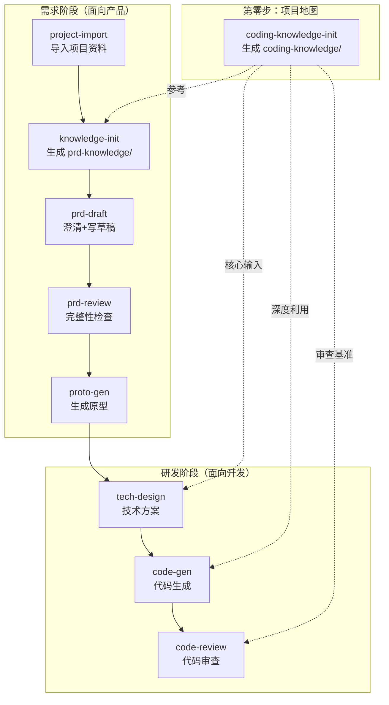

## Purpose

这是整套 AI 辅助需求-开发工作流的"宪法"——集中定义所有 skill 共享的约定，确保整条流水线的输入输出能正确对接。

各 skill 不再各自定义这些规范，而是引用本 skill。如果约定需要调整，改这一个地方就行。

## 工作流全景



**三个阶段**：

- **第零步（项目地图）**：`coding-knowledge-init` 扫描代码仓库生成 `coding-knowledge/`，是整个体系的地基。一个项目只需执行一次，代码架构有大变动时重新执行。
- **需求阶段（PRD 管线）**：从项目资料到原型，面向产品需求分析。每个环节的产出是下一个环节的输入。
- **研发阶段（编码管线）**：从技术方案到代码实现再到代码审查，面向开发落地。

**coding-knowledge 是地基**：

`coding-knowledge/` 贯穿整个体系，不是某个阶段的专属工具：
- `knowledge-init` 参考它生成更精确的 `prd-knowledge/`
- `tech-design` 以它为核心输入做改动范围定位和接口设计
- `code-gen` 深度利用它学习项目编码模式，生成风格一致的代码
- `code-review` 以它为审查基准，用项目标准（而非通用最佳实践）审查代码

**两套知识库各司其职，不合并**：

| 知识库 | 视角 | 用途 | 冲突时 |
|--------|------|------|--------|
| `prd-knowledge/` | 业务语义、产品上下文 | 写 PRD、评审需求 | — |
| `coding-knowledge/` | 代码架构、符号索引、调用链 | 写技术方案、写代码、审查代码 | 以此为准（基于实际代码分析） |

用户可以从任意环节开始（比如已有代码直接跑 knowledge-init），但完整走一遍效果最好。

---

## 1. 项目根目录

**项目根目录**是 `{project_name}/` 目录，即 `sources/` 的父目录。所有 skill 的输入/输出路径都相对于此目录。

判断优先级：
1. 如果当前工作目录下存在 `sources/` 目录 → 当前目录即为项目根目录
2. 如果当前工作目录下存在 `prd-knowledge/` 或 `coding-knowledge/` 目录 → 当前目录即为项目根目录
3. 否则 → 使用当前工作目录

---

## 2. PRD 的 7 模块标准结构

所有 PRD 文档（prd-draft 产出、prd-review 检查）遵循以下 7 模块结构：

| 编号 | 模块 | 内容 |
|------|------|------|
| 1 | 需求背景 | 需求来源、上下文、触发原因、需求范围 |
| 2 | 需求价值 | 业务目标（量化）、用户收益、优先级 |
| 3 | 功能清单 | 功能列表，含优先级、输入/输出/约束 |
| 4 | 业务流程图 | 核心操作流程（Mermaid 语法），含角色标注和异常分支 |
| 5 | 数据模型 | 实体定义、字段（类型/约束）、实体关系、枚举值 |
| 6 | 需求详情 | 每个功能的交互说明、验收标准、边界条件、错误处理 |
| 7 | 权限管理 | 角色权限矩阵、数据权限、与现有权限体系的关系 |

**PRD 产品导向原则**：PRD 是面向业务方的文档，全篇使用产品语言。禁止出现类名、方法名、表名、字段名等代码实现细节——这些属于 tech-design 的范畴。

---

## 3. coding-knowledge/ 标准文件清单

`coding-knowledge-init` 生成的编码知识库目录，位于项目根目录下，是整个体系的技术地基：

```
coding-knowledge/
├── config.yaml                       # 项目配置：业务名称、子模块、仓库映射
├── INDEX.md                          # 顶层索引：三层知识概览和导航
├── infra/                            # 第1层：基础技术层
│   ├── INDEX.md
│   ├── tech-stack.md                 # 技术栈规范
│   ├── middleware.md                 # 基础设施与中间件规范
│   ├── app-architecture.md           # 应用选型与分层规范
│   ├── code-quality.md               # 代码质量规范
│   ├── cicd.md                       # CI/CD 平台与流程
│   └── security.md                   # 安全合规规范
├── business/                         # 第2层：业务层
│   ├── INDEX.md
│   ├── overall-architecture.md       # 整体业务架构与服务拓扑
│   ├── glossary.md                   # 业务术语表
│   └── domains/                      # 细分业务架构
│       └── {domain-name}/
│           ├── overview.md           # 领域概述、核心流程
│           ├── domain-model.md       # 领域模型与数据关系
│           └── cross-service.md      # 跨仓库调用关系
├── repos/                            # 第3层：代码仓库层
│   ├── INDEX.md                      # 仓库层索引（含场景→模块路由表）
│   └── {repo-name}/
│       ├── architecture.md           # 仓库代码架构（含职责边界）
│       ├── codebase-index.md         # 代码索引
│       ├── symbols.md               # 关键类/方法/接口签名索引
│       ├── database-schema.md        # 数据库表结构
│       └── call-chains.md            # 核心业务调用链
└── knowledge-gaps.md                 # 知识完整性检查报告（含质量评分卡）
```

| 层 | 核心文件 | 下游 skill 如何使用 |
|----|---------|---------------------|
| infra | `code-quality.md` | code-gen/code-review：全局编码规范基准 |
| business | `glossary.md`, `cross-service.md` | tech-design：跨服务调用关系；knowledge-init：业务语义参考 |
| repos | `symbols.md` | tech-design：精确定位代码位置；code-gen：风格学习入口；code-review：审查参考 |
| repos | `architecture.md` | tech-design：判断功能归属和职责边界；code-gen：确定新文件包路径 |
| repos | `database-schema.md` | tech-design：参考建表风格；code-gen：复刻字段命名规范 |
| repos | `call-chains.md` | tech-design：追踪调用链完整性；code-gen：学习跨服务调用方式；code-review：验证调用模式一致性 |

---

## 4. prd-knowledge/ 标准文件清单

`knowledge-init` 生成的 PRD 知识库目录，位于项目根目录下：

| 文件 | 内容 | 下游 skill 如何使用 |
|------|------|---------------------|
| `architecture.md` | 技术栈、模块划分、部署结构 | prd-draft: 判断技术可行性 |
| `glossary.md` | 业务术语定义和关系 | prd-draft/prd-review: 确保术语一致 |
| `user-roles.md` | 用户角色、权限矩阵 | prd-draft/prd-review: 权限设计参考 |
| `data-model.md` | 核心实体、字段、关系、约束 | prd-draft/prd-review: 数据模型校验 |
| `existing-features.md` | 现有功能清单（按模块） | prd-draft/prd-review: 避免重复建设 |
| `api-inventory.md` | 接口清单（URL、方法、参数） | prd-review: 检查接口影响 |
| `design-patterns.md` | 已有交互模式和 UI 组件 | proto-gen: 参考现有风格 |
| `business-flows.md` | 核心业务流程（Mermaid 语法） | prd-draft/prd-review: 流程衔接 |
| `knowledge-gaps.md` | 知识库完整性检查报告 | 用户参考，决定是否补充 |

---

## 5. requirements/{模块名}/ 目录规范

每个业务模块（需求）在项目根目录下的 `requirements/` 中拥有独立目录。模块名由 prd-draft 在澄清阶段与用户确认，也可以理解为需求名称。

```
{project_root}/
├── sources/                          # project-import 产出
├── prd-knowledge/                    # knowledge-init 产出
├── coding-knowledge/                 # coding-knowledge-init 产出（第零步）
└── requirements/
    └── {模块名}/                     # 如"知识管理"、"FAQ管理"
        ├── prd-draft.md              # prd-draft 产出
        ├── review/                   # prd-review 产出
        │   ├── review-summary.md     # 总览报告
        │   ├── 需求背景.md
        │   ├── 需求价值.md
        │   ├── 功能清单.md
        │   ├── 业务流程图.md
        │   ├── 数据模型.md
        │   ├── 需求详情.md
        │   └── 权限管理.md
        ├── prototype/               # proto-gen 产出
        │   ├── index.html
        │   ├── styles.css
        │   ├── list.html
        │   ├── detail.html
        │   ├── form.html
        │   └── ...
        ├── tech-design.md            # tech-design 产出
        ├── code-gen-report.md        # code-gen 产出
        └── code-review/              # code-review 产出
            ├── review-summary.md     # 总览报告
            └── {仓库名}.md           # 按仓库的详细报告
```

---

## 6. 各 skill 输入/输出路径汇总

### 第零步

| Skill | 输入 | 输出 | 说明 |
|-------|------|------|------|
| coding-knowledge-init | 多个代码仓库路径 | `{project_root}/coding-knowledge/` | 项目技术地基，一个项目只需执行一次 |

### 需求阶段

| Skill | 输入 | 输出 |
|-------|------|------|
| project-import | TAPD 链接 / Git 仓库地址 | `{project_root}/sources/` |
| knowledge-init | `sources/` + `coding-knowledge/`(参考) | `{project_root}/prd-knowledge/` |
| prd-draft | 用户需求描述 + `prd-knowledge/` + `coding-knowledge/`(可选参考) | `requirements/{模块名}/prd-draft.md` |
| prd-review | `requirements/{模块名}/prd-draft.md` + `prd-knowledge/` | `requirements/{模块名}/review/` |
| proto-gen | `requirements/{模块名}/prd-draft.md` + 前端代码 | `requirements/{模块名}/prototype/` |

### 研发阶段

| Skill | 输入 | 输出 |
|-------|------|------|
| tech-design | `prd-draft.md` + `prototype/` + `prd-knowledge/` + `coding-knowledge/` + 后端代码 | `requirements/{模块名}/tech-design.md` |
| code-gen | `tech-design.md` + `prd-draft.md` + `prototype/` + `coding-knowledge/` + 源码仓库 | 代码变更 + `requirements/{模块名}/code-gen-report.md` |
| code-review | 代码变更 + `tech-design.md` + `prd-draft.md` + `coding-knowledge/` | `requirements/{模块名}/code-review/` |

### 辅助工具

| Skill | 输入 | 输出 |
|-------|------|------|
| tapd-sync | 本地 Markdown + TAPD 链接 | 更新 TAPD 需求单 |

---

## 7. coding-knowledge 在研发阶段的统一使用策略

研发阶段三个 skill（tech-design、code-gen、code-review）对 coding-knowledge 的使用策略一脉相承：

### 三层读取策略（三个 skill 统一）

```
第一层：infra/（全局标准）
  → code-quality.md、middleware 规范等

第二层：repos/{repo}/（按涉及仓库读取）
  → architecture.md、symbols.md、database-schema.md、call-chains.md

第三层：business/domains/{domain}/（按需读取）
  → cross-service.md、domain-model.md
```

### 各 skill 的侧重点

| 策略 | tech-design | code-gen | code-review |
|------|------------|---------|-------------|
| symbols.md | **定位**：找到需要修改的类和方法 | **学习**：找同类型参考文件，Read 完整源码学习编码模式 | **对照**：找同类型参考文件作为"好代码的参考答案" |
| architecture.md | 判断功能归属和职责边界 | 确定新文件放在哪个包 | 检查代码是否放在正确的层/包 |
| database-schema.md | 参考建表风格设计 DDL | 复刻字段命名规范生成 Entity | 检查索引完整性和命名一致性 |
| call-chains.md | 追踪完整调用链，杜绝遗漏 | 学习跨服务调用的实际写法 | 验证调用方式是否与现有模式一致 |
| code-quality.md | — | 遵守编码规范生成代码 | 作为代码质量检查的基准 |

### 核心原则

- **标准从项目中来**：不用通用最佳实践，用这个项目的实际编码模式
- **风格对照而非风格发明**：如果整个项目都用 `@Autowired`，新代码用 `@Autowired` 就不是问题
- **冲突时以 coding-knowledge 为准**：它基于实际代码分析，比 prd-knowledge 的业务推断更可靠

---

## 8. PRD 版本管理

prd-draft 在 YAML frontmatter 中标注 `version: "draft-v1"`。修改 PRD 后建议手动更新版本号（draft-v2、draft-v3）。prd-review 在报告中会标注检查的是哪个版本。

典型迭代流程：
```
prd-draft → draft-v1 → prd-review(v1) → 修复阻塞 → draft-v2 → prd-review(v2) → 通过 → proto-gen
```

---

## 9. 问题分级标准（全局统一）

prd-review、code-review 共用同一套三级分级体系：

| 级别 | 含义 | 示例 |
|------|------|------|
| 🔴 阻塞 | 不修复不能通过 | 安全漏洞、需求功能遗漏、接口参数不一致 |
| 🟡 建议 | 建议修复但不阻塞 | 与项目风格不一致、缺少必要注释、性能隐患 |
| 🔵 提示 | 优化建议 | 可选的代码重构、更优雅的实现方式 |

---

## 10. 快速上手指南

**第一次使用整套流程：**

**第零步：构建项目地图**
0. `coding-knowledge-init` — 扫描代码仓库，生成 `coding-knowledge/` 编码知识库。这是整个体系的地基，建议最先执行。

**需求阶段（PRD 管线）：**
1. `project-import` — 粘贴 TAPD 链接或 Git 仓库地址，自动拉取项目资料
2. `knowledge-init` — 扫描代码和文档，参考 `coding-knowledge/` 生成 `prd-knowledge/` 知识库
3. `prd-draft` — 描述你的需求，AI 先澄清模糊点再生成 PRD 草稿
4. `prd-review` — 检查草稿完整性，按阻塞/建议/提示分级
5. 修改 PRD → 重跑 `prd-review` → 直到阻塞清零
6. `proto-gen` — 基于 PRD 终稿生成 HTML 原型

**研发阶段（编码管线）：**
7. `tech-design` — 基于 PRD + 原型 + 两套知识库生成技术方案（改动范围、接口设计、DDL、任务拆解）
8. `code-gen` — 基于技术方案 + PRD + 原型 + 编码知识库，在目标仓库中生成完整业务代码
9. `code-review` — 四维度审查：需求覆盖、技术方案合规、代码质量、安全与性能
10. `tapd-sync` — 将 PRD 或技术方案同步到 TAPD 需求单

**只用其中一个 skill：** 每个 skill 都可以独立使用，只是没有知识库时分析精度会下降。
