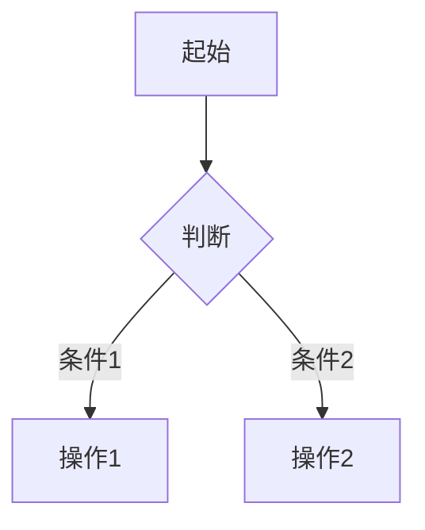
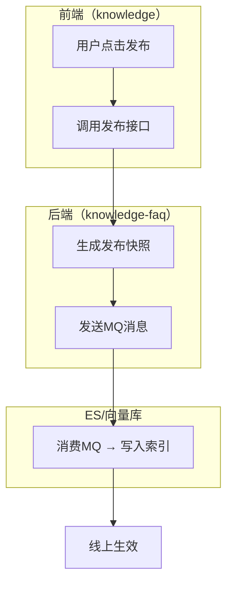

## Purpose

PRD 撰写中最常见的坑：拿到一段模糊的需求描述，直接生成一份看起来完整的文档。问题是文档里充满了 AI 自己编的假设，用户拿到后要花大量时间逐条修改。

这个 skill 的核心理念是**先问再写**。它读取项目知识库理解现有系统，分析用户的需求描述识别模糊点，然后通过结构化的澄清对话让用户确认关键细节。只有在模糊点被充分澄清后，才生成 PRD 草稿——而且对于仍未确认的部分，会明确标注为"待确认"而不是悄悄假设。

## 输入

- 用户的需求描述（自然语言，可以很粗略）
- 项目知识库（优先 `coding-knowledge/business/prd-reference/`，兼容 `prd-knowledge/`）

## 工作流程

### Gate Check: 新建还是修改？（最先执行，在 Phase 1 之前）

**每次调用本 skill 时，必须先执行此检查，无例外。**

1. 检查用户指定的输出目录下是否已存在 `prd-draft.md` 文件
2. 如果 **存在** → 进入修改模式（跳过 Phase 1-4，直接执行修改模式的 M-Step 1-4）
   - 先 Read `references/modification-mode.md` 获取完整流程
   - 然后按 M-Step 1-4 执行
3. 如果 **不存在** → 进入首次生成模式（执行 Phase 1-4）

**为什么需要 Gate Check**：不做此检查时，AI 容易把"修改已有 PRD"误判为"生成新 PRD"，或者在对话中收到用户的修改请求后直接 Edit 文件而不走修改流程。Gate Check 确保只要 `prd-draft.md` 已存在，所有操作都走修改模式——包括版本递增和变更记录。

### Phase 1: 理解上下文（静默执行，不需要用户参与）

1. **读取 PRD 参考知识库**：按以下优先级查找知识库文件：
   - **优先**：`coding-knowledge/business/prd-reference/` 目录（与编码知识库集成，信息更完整）
   - **兼容**：`prd-knowledge/` 目录（独立知识库，旧项目可能使用此结构）

   读取以下文件建立对现有系统的理解：
   - `existing-features.md` — 了解现有功能，避免重复建设
   - `user-roles.md` — 了解现有角色体系，权限设计要兼容
   - `business-flows.md` — 了解现有业务流程，新功能要嵌入现有体系
   - `glossary.md` — 了解业务术语（读"业务定义"部分），确保用语一致
   - `design-patterns.md` — 了解现有交互模式，保持 UI 一致性
   - `data-model.md` — 了解现有数据结构（仅 prd-knowledge/ 路径下存在时读取）

2. **读取编码知识库**（可选）：如果项目根目录下存在 `coding-knowledge/` 目录，可以读取以下文件来**理解现有系统的能力和约束**：
   - `repos/{repo}/architecture.md` — 了解各服务的职责边界
   - `business/glossary.md` — 补充业务术语理解（含跨系统别名映射和状态枚举）
   - `business/domains/{domain}/overview.md` — 了解现有业务流程
   - `repos/{repo}/database-schema.md` — 了解现有数据结构

   **重要：coding-knowledge 的信息仅用于帮助你理解"系统现在能做什么、不能做什么"，从而写出更准确的需求描述。这些信息不应直接出现在 PRD 中**——不要在 PRD 里写类名、方法名、表名、字段名等代码层面的细节。PRD 的读者是产品经理、业务方、测试，不是开发。技术实现细节属于下游的 tech-design。

3. **分析需求描述**：解读用户输入的需求描述，提取以下信息：
   - 核心要做什么（功能目标）
   - 涉及哪些角色
   - 涉及哪些数据对象
   - 与现有系统的关联点

3. **识别模糊点**：对比需求描述和知识库，找出需要澄清的问题。模糊点通常出现在：
   - **范围不清**：用户说"管理 XX"，但没说包含增删改查中的哪些操作
   - **角色不明**：没说谁来用这个功能，或者多个角色的权限边界不清
   - **流程缺失**：描述了起点和终点，但中间的审核/审批/状态流转没提
   - **数据关系模糊**：新增的数据对象和现有对象是什么关系
   - **异常处理空白**：只说了正常流程，没提失败/取消/超时怎么办
   - **与现有功能的关系**：知识库中有类似功能，是增强还是新建？
   - **"保持一致"类模糊描述**：用户说"与 XX 功能保持一致"、"复用 XX 交互"、"同 XX"等，但没说具体一致的范围——是 UI 布局一致？交互逻辑一致？数据结构一致？权限模型一致？还是全部一致？必须追问确认具体哪些方面保持一致，不要自行脑补展开描述

### Phase 2: 澄清对话（5-8 轮，每轮一个问题）

这是整个 skill 的核心环节。目标不是问完所有可能的问题，而是问**最影响 PRD 质量的那几个问题**。

#### 问题设计原则

- **每轮只问一个问题**，降低用户的认知负担
- **每个问题提供 2-4 个选项**，用户可以直接选，也可以自由回答
- **选项要具体**，不要"是/否"这种抽象选项，而是给出具体的场景描述
- **问题有优先级**：先问范围和角色（影响全局），再问流程和数据（影响细节），最后问边界和异常
- **结合知识库生成选项**：如果知识库中有相关信息，用它来生成更精准的选项

#### 问题优先级顺序

1. **需求命名与模块归属**（必问）：确认这个需求的名称（用于目录命名和文档标题），以及它属于哪个业务模块。模块名也可以理解为需求名称，例如"知识管理"、"FAQ 管理"。这个名称将用于输出目录 `requirements/{模块名}/`，后续 prd-review 和 proto-gen 也会在同一目录下输出。
2. **范围确认**（必问）：这个需求包含哪些核心功能？
3. **角色确认**（必问）：哪些角色会使用？各自能做什么？
4. **核心流程**（必问）：主要操作流程是什么样的？
5. **配置模型验证**（按需，涉及修改现有配置页面时必问）：当需求涉及在现有页面上新增字段或修改配置项时，应追问确认：
   - 新字段添加在哪个配置页面/表单上？
   - 新字段与现有字段的关系是什么？（独立字段 / 替换现有字段 / 现有字段的子选项）
   - 现有页面上相关字段的前端展示选项是什么？（不要从代码枚举推断，要确认用户实际看到的选项）
   - 新字段是每个关联对象独立配置，还是统一配置？
   这样做的原因是：AI 容易从 coding-knowledge 的代码枚举推断出错误的配置模型（例如把"新增独立字段"误解为"给现有枚举加新值"），而这类错误会导致整个 PRD 的数据模型和交互设计偏离实际。
6. **数据关系**（按需）：涉及哪些数据对象？和现有数据的关系？
7. **与现有功能的关系**（按需，知识库中有相似功能时问）
8. **异常处理**（按需）：关键异常场景怎么处理？
9. **优先级**（按需）：如果功能较多，哪些是第一期必须做的？
10. **其他约束**（按需）：性能要求、兼容性要求等

#### 每轮对话的格式

```
📋 问题 X/N — {问题类别}

{问题描述，说明为什么需要确认这个点}

1. {选项 A}（{简要说明}）
2. {选项 B}（{简要说明}）
3. {选项 C}（{简要说明}）
4. 其他（请描述）

💡 知识库参考：{如有相关的知识库信息，在这里简要引用}
```

#### 何时结束澄清

- 最少 5 轮（确保核心问题被覆盖）
- 最多 8 轮（避免用户疲劳）
- 如果用户主动说"差不多了"或"直接生成吧"，尊重用户意愿，提前结束
- 结束前简要总结已确认的要点，让用户确认

#### 待确认项的阻塞检查（结束澄清前必做）

在结束澄清、进入生成阶段之前，检查所有待确认项：
- 如果某个待确认项直接影响功能的**验收标准设计**（如枚举值列表、交互模式选择、数据格式定义），应追问一轮尝试确认，而不是直接标为待确认
- 如果正文中已有倾向性结论（如"建议一期用固定枚举"），对应的待确认项应标注为"已有建议方案，待最终确认"，并在正文中保持一致——不能正文写了结论，待确认项还是开放式问题
- 这样做的原因是：测试团队无法基于开放式待确认项设计测试用例，哪怕给出一个倾向性方案也比完全空白强

#### 澄清结束时的总结

```
✅ 澄清完成，以下是确认结果：

**已确认：**
- {要点 1}
- {要点 2}
- ...

**默认假设（未明确讨论，按常见做法处理）：**
- {假设 1}
- {假设 2}

**待确认（需要后续补充）：**
- {待确认项 1}
- {待确认项 2}

确认无误后，我来生成需求上下文和 PRD 草稿。
```

#### 生成需求上下文文件（prd-context.md）

在进入 PRD 生成之前，先将澄清结论提炼为 `requirements/{模块名}/prd-context.md`。这个文件的定位是**需求决策基线**——记录用户做出的所有选择和客观业务约束，后续修改、评审、原型生成都以此为基准判断一致性。

**文件格式**：

```markdown
# 需求上下文

> 本文件记录需求中经过确认的决策和业务事实，作为后续修改和评审的基准。
> 由 prd-draft 自动维护，无需手动编辑。

## 需求决策

用户做出的选择——"做什么、不做什么、怎么做"。每条决策的特征是：用户本可以选择另一个方案。

- [{日期} {时间} v1] {决策描述，如"本次仅对接 CFCA，不涉及 SSQ"}
- [{日期} {时间} v1] {决策描述}

## 业务事实

客观存在的业务现状和约束条件，不是用户的选择，而是事实。

- [{日期} {时间} v1] {事实描述}

## 变更记录

决策被修改或推翻时记录在此。格式与 PRD 变更记录保持一致。

| 版本 | 日期 | 变更内容 | 来源 |
|------|------|----------|------|
```

**写入判断标准**：问一句"用户本可以选别的方案吗？"——能 → 需求决策，不能 → 业务事实。

**写入规则**：
- 只记录已确认的决策和事实，不记录讨论过程或被否决的方案
- 决策被推翻时：从"需求决策"中更新为新结论，旧结论移入"变更记录"（不用删除线留在正文）
- 每条一行，时间戳精确到秒（`YYYY-MM-DD HH:MM:SS`），带版本号
- **时间戳必须取系统实际时间**：写入时间戳前必须先执行 `date '+%Y-%m-%d %H:%M:%S'` 获取当前时间，禁止估算或凭记忆填写。会话可能跨越数小时，估算时间会导致记录与实际严重不符

### Phase 3: 生成 PRD 草稿

**基于 prd-context.md 中的需求决策展开描述**——PRD 不是凭空生成，而是将 context 中的每条决策展开为完整的功能描述、流程设计、数据模型等，同时确保不与业务事实矛盾。这样确保 PRD 的每个关键决策都可以追溯到 context。

在 `requirements/{模块名}/` 目录下生成 `prd-draft.md`。

#### 文档结构

```markdown
---
# PRD 核心信息（YAML frontmatter，方便下游 AI 解析）
title: "{需求标题}"
module: "{所属模块}"
version: "draft-v1"
date: "{生成日期}"
status: "draft"
roles:
  - name: "{角色名}"
    permissions: ["{权限1}", "{权限2}"]
core_entities:
  - name: "{业务概念名称，如'签章策略'而非'ESealStrategy'}"
    key_fields: ["{业务属性，如'签章类型'而非'FstrSealType'}"]
    relations: ["{业务关联，如'关联合同模板'}"]
priority: "{P0/P1/P2}"
dependencies:
  - "{依赖的现有功能或模块}"
---

# {需求标题} — PRD 草稿

# 一、需求背景

## 1.1 需求来源
{谁提出的，什么场景触发的}

## 1.2 现状问题
{当前的痛点，有数据支撑更好}

## 1.3 需求范围
**本次包含：**
1. {功能点 1}
2. {功能点 2}

**本次不含：**
1. {排除项 1}

# 二、需求价值

## 2.1 业务目标
{量化的目标指标}

## 2.2 用户收益
{对各角色的具体好处}

# 三、功能清单

| 编号 | 功能名称 | 优先级 | 状态 |
|------|----------|--------|------|
| F-01 | {功能名} | P0 | ✅ 已确认 |
| F-02 | {功能名} | P1 | ⚠️ 待确认 |

> 各功能的输入、输出、约束、交互说明、验收标准等详细描述见第六章需求详情。

# 四、业务流程图

{使用 Mermaid 语法绘制核心流程。如果流程涉及多个系统/服务/角色，使用泳道图（subgraph）按系统拆分，而不是简单的 flowchart。}

**单系统流程示例：**



**跨系统泳道图示例（涉及多个系统时必须使用此格式）：**



**异常分支：** {异常路径说明，每个判断节点至少两个分支}

# 五、数据模型

## 5.1 实体定义

> 数据模型使用业务概念命名，不使用代码类名或数据库表名。
> 技术落地时的具体表结构、字段映射由 tech-design 阶段确定。

### 5.1.1 {业务概念名称}

| 属性 | 类型 | 必填 | 说明 | 约束 |
|------|------|------|------|------|
| 编号 | 长整数 | 是 | 唯一标识 | 自增 |
| {业务属性名} | {类型} | {是/否} | {业务含义说明} | {业务规则约束} |

## 5.2 实体关系
{用业务语言描述关联关系，如"一个合同模板可配置多个签章主体"}

## 5.3 与现有数据的关系
{用业务语言说明与现有概念的衔接，如"复用现有的签章策略配置，不新增数据表"}

# 六、需求详情

## 6.1 F-01: {功能名称}

**功能描述：** {一句话描述}

**输入：** {用户输入或系统输入}
**输出：** {操作结果}
**约束：** {限制条件}

**交互说明：**
1. {页面布局描述}
2. {操作流程描述}
3. {反馈方式描述}

**交互流程：**（涉及多步骤交互时必须补充）

> 当功能包含多步操作（如分步表单、弹窗确认链、状态流转等），用步骤列表或 Mermaid 图说明完整的交互序列，
> 包括每一步的触发条件、页面跳转/弹窗行为、中断/取消后的恢复方式。

```
步骤 1: {用户操作} → {页面响应}
步骤 2: {用户操作} → {页面响应}
  ├─ 成功 → {下一步}
  └─ 失败 → {错误提示及恢复方式}
步骤 3: ...
```

**验收标准：**
1. {可测试的验收条件 1}
2. {可测试的验收条件 2}

**边界条件：**
1. {最大值/最小值/空值处理}

**错误处理：**
1. {错误场景} → {提示信息和处理方式}

# 七、权限管理

## 7.1 角色权限矩阵

| 功能 | {角色1} | {角色2} | {角色3} |
|------|---------|---------|---------|
| {功能1} | 查看/编辑 | 查看 | 无 |
| {功能2} | 全部 | 查看/编辑 | 查看 |

## 7.2 数据权限
{数据可见范围说明}

## 7.3 与现有权限体系的关系
{引用知识库 user-roles.md，说明兼容情况}

---

# 八、待确认项

以下问题在澄清阶段未能完全确认，需要后续与相关方讨论后补充：

| 编号 | 问题 | 影响范围 | 建议 |
|------|------|----------|------|
| Q-01 | {待确认问题} | {影响哪些功能} | {默认处理建议} |
| Q-02 | {待确认问题} | {影响哪些功能} | {默认处理建议} |

---

# 九、默认假设

以下内容未在澄清中明确讨论，按常见做法处理。如有异议请标注：

| 编号 | 假设内容 | 依据 |
|------|----------|------|
| A-01 | {假设内容} | {知识库参考/行业惯例} |
```

#### 标题编号规则

PRD 各章节标题必须带序号，方便在评审和沟通时精确引用（如"请看 3.2 的验收标准"）。编号规则：

- 一级标题（`#`）使用中文数字：一、二、三、……
- 二级标题（`##`）使用阿拉伯数字：1.1、1.2、2.1、……
- 三级标题（`###`）使用阿拉伯数字：1.1.1、1.1.2、……
- 功能编号（F-01、F-02）保留在标题中，与章节编号并用，如 `## 7.1 F-01: 盖章模式配置`

示例：
```
# 一、需求背景
## 1.1 需求来源
## 1.2 现状问题
## 1.3 需求范围
# 二、需求价值
## 2.1 业务目标
## 2.2 用户收益
# 三、功能清单
# 四、业务流程图
# 五、数据模型
## 5.1 现有模型变更
## 5.2 实体关系
# 六、需求详情
## 6.1 F-01: xxx
## 6.2 F-02: xxx
# 七、权限管理
```

#### 文档生成原则

- **产品导向，业务方可读**：PRD 的读者不只是开发和测试，还包括业务方、产品负责人、法务等非技术角色。全文必须使用产品语言和业务语言，让不懂代码的人也能无障碍阅读。具体要求：
  - **禁止出现代码实现细节**：不写类名（如 `SealHandlerServiceImpl`）、方法名（如 `genSealStrategyJson()`）、表名（如 `t_e_seal_strategy`）、字段名（如 `FstrSealLx`）、包名、注解名等
  - **用业务语言描述功能行为**：写"签章服务根据 PDF 实际页数，自动在每页相同位置生成签章"，而不是"ESealStrategyService 动态生成 N 条签章策略 JSON"
  - **数据模型用业务概念命名**：写"签章策略"而不是"ESealStrategy"，写"签章配置"而不是"ContractBody"，字段说明用中文业务含义
  - **流程图用角色/系统名称**：泳道标签写"运营后台"、"签章服务"、"合同生成引擎"，而不是写服务代号（如 `atm_api`、`e_seal_srv`）
  - **验收标准描述可观测的业务结果**：写"生成的 PDF 每页都有签章"，而不是"SealHandlerServiceImpl 识别 PER_PAGE 类型后调用动态策略生成"
  - **错误处理用用户视角**：写"签章失败时提示具体原因，合同进入重试流程"，而不是"failReason 记录到 t_e_contract 表"
  - coding-knowledge 中的技术细节可以帮你理解系统能力、判断需求可行性、设计合理的功能边界，但输出到 PRD 时必须翻译为产品语言。技术实现细节（改哪个服务、调哪个接口、数据库怎么改）留给下游的 tech-design skill
- **"与 XX 保持一致"不展开**：如果用户说"与某功能保持一致"但未在澄清阶段确认具体范围，PRD 中只写"与 XX 功能保持一致（具体范围见待确认项）"，不要自行发挥描述该功能的细节
- **已确认的内容写实**：基于澄清对话中用户确认的信息，忠实还原
- **待确认的内容标注**：在功能清单中标 ⚠️，在文末的"待确认项"中详细列出
- **默认假设明示**：不要悄悄假设，所有推断都在"默认假设"章节中列出依据
- **引用知识库**：在数据模型、权限管理等模块中，用业务语言引用知识库中的相关信息（如"现有签章策略配置"），帮助读者理解新需求与现有系统的关系，但不暴露底层表名或代码结构
- **需求详情标注输入/输出/约束**：每个 F-XX 的输入、输出、约束是下游 AI（如 proto-gen、tech-design）解析的关键信息，必须在第六章需求详情中完整描述
- **有序列表每项必须独占一行**：凡是用 `1. 2. 3.` 编号的列表（如"本次包含"、"本次不含"、验收标准等），每个编号必须换行，严禁将多个编号挤在同一行

#### 章节分工与去重原则

PRD 各章节有明确的信息归属，**同一信息只在归属章节完整描述，其他章节引用而非复述**。

| 信息类型 | 归属章节（完整描述） | 其他章节（引用方式） |
|----------|---------------------|---------------------|
| 功能的输入/输出/约束 | 六、需求详情（每个 F-XX 内完整描述） | 三、功能清单只保留编号、名称、优先级、状态，作为索引表 |
| 需求范围 | 一、需求背景 > 1.3 | 三、功能清单不重复列举范围，只列功能条目 |
| 业务流程 | 四、业务流程图 | 六、需求详情中只写该功能特有的交互步骤，不重复整体流程 |
| 角色权限 | 七、权限管理 | 六、需求详情中不逐功能重复角色限制，仅在权限矩阵中统一定义 |
| 实体字段定义 | 五、数据模型 | 六、需求详情的表单描述中引用"见数据模型 5.1.1"，不重复列字段 |
| 错误处理 | 六、需求详情（每个 F-XX 内） | 四、流程图中异常分支只标节点名，详细提示文案在需求详情中 |

**具体执行**：

1. **功能清单是索引表**：功能清单（第三章）只保留编号、功能名称、优先级、状态四列，让人一眼看清"做哪些功能"。输入/输出/约束的完整描述放在需求详情（第六章）每个 F-XX 中，避免功能清单表格过宽且与需求详情重复
2. **流程图与交互流程互补不重叠**：第四章的业务流程图描述端到端全局流程（跨角色/跨系统），第六章的交互流程只描述该功能特有的页面级操作步骤（点击什么→弹什么窗→成功/失败怎么处理）。如果某功能的交互就是全局流程的一个子集且无额外细节，写"交互流程见业务流程图第 X 步"即可
3. **数据模型定义一次**：实体字段在第五章定义，第六章的表单描述中如需提及字段，写"表单字段对应数据模型 5.1.1 中的 XX 实体"，不复制字段表格
4. **权限集中管理**：第七章权限矩阵是权限的唯一归属地。第六章不逐功能写"仅 XX 角色可操作"，如需强调特殊权限逻辑（如数据行级权限），在第七章补充说明

#### 每个功能必须有验收标准（无例外）

每个 F-XX 功能的需求详情中**必须包含「验收标准」小节**，即使功能描述为"与现有功能一致"或"复用 C 端交互"。这是因为测试团队需要据此设计测试用例——"与 C 端一致"不是可执行的验收条件。

对于复用型功能，验收标准应明确：
- 复用的具体行为（如"支持新增、删除相似问句，IM/IVR 独立管理"）
- 数据范围差异（如"仅展示坐席辅助 FAQ 类型的数据，不与 C 端 FAQ 交叉"）
- 与被复用功能的差异点（如有）

#### Mermaid 节点文字必须用双引号包裹

所有 Mermaid 节点的文字内容**一律用双引号包裹**，避免特殊字符导致渲染失败。以下字符在 Mermaid 中有保留含义，不加引号会导致解析错误：
- `→`（全角箭头）— 与 Mermaid 箭头语法混淆
- `:`（冒号）— Mermaid 中用于标签定义
- `(` `)` `{` `}` `[` `]` — Mermaid 中用于节点形状定义

正确写法：`A["提示：请先解除应用绑定"]`、`B{"校验通过?"}`
错误写法：`A[提示:请先解除应用绑定]`、`G[勾选 → 批量操作]`

同时避免在节点文字中使用 `→`，改用文字描述（如"勾选后批量操作"代替"勾选 → 批量操作"）。

#### 流程图必须覆盖异常分支

业务流程图生成规则：
- 每个判断节点必须有至少两个分支（正常路径 + 异常/失败路径）
- 涉及异步操作（MQ 同步、ES 写入、外部服务调用）的节点，必须标注失败分支
- 失败分支需说明：页面提示信息、状态是否回滚、是否支持手动重试
- 这样做的原因是：缺少异常分支的流程图会导致测试团队遗漏异常场景的用例设计，开发也容易忽略错误处理逻辑

#### 跨系统流程必须使用泳道图

当业务流程涉及多个系统/服务（如前端、后端、MQ、ES、第三方服务）时，必须使用 Mermaid `subgraph` 按系统拆分为泳道图，而不是把所有节点平铺在一张 flowchart 里。这样做的好处是：
- 开发能直观看到每个服务的职责边界
- 技术方案阶段可以直接据此拆分改动范围
- 测试能据此设计跨服务集成测试用例

判断标准：如果流程中的节点分属不同的仓库/服务/系统（从知识库 `architecture.md` 可知），就应该用泳道图。

#### 多步骤交互必须补充交互流程

当需求详情中的功能涉及多步骤交互（分步表单、弹窗确认链、先选择再配置、状态流转操作等），必须在「交互说明」之后补充「交互流程」小节，用步骤列表或 Mermaid 图描述完整的操作序列。每一步需说明：
- 触发条件（用户点击什么 / 满足什么条件）
- 页面响应（跳转、弹窗、区域刷新）
- 分支处理（成功/失败/取消各自的后续行为）

这样做的原因是：纯文字的「交互说明」容易遗漏步骤间的衔接逻辑（如"取消后回到哪个状态"、"保存失败后表单数据是否保留"），导致开发自行决定、测试无据可依。

#### 从知识库提取枚举值和菜单路径

生成 PRD 时，应主动从知识库中提取以下信息写入文档：
- `existing-features.md` 中的枚举值列表（渠道类型、状态值、配置选项等），写入对应功能的需求详情
- `design-patterns.md` 中的菜单层级路径（如"知识库 > 坐席辅助知识库 > FAQ管理"），写入页面结构章节
- 如果前端使用动态路由（从 architecture.md 可知），输出菜单路径而非路由路径
- `data-model.md` 中相关实体的现有枚举值定义，写入数据模型章节
- 这些信息知识库中已有，不写入 PRD 会导致下游测试和开发反复去知识库查找

#### 错误处理必须包含具体提示文案

需求详情中的"错误处理"部分，必须给出用户可见的具体提示文案，而不是只描述场景。例如：
- 好的写法：`删除已绑定应用的机器人类型时 → 提示"该机器人类型已绑定应用{应用名}，请先解除绑定后再删除"`
- 不好的写法：`删除已关联应用的类型时不能删除`

### Phase 3.5: 写入 PRD 守护规则到项目 CLAUDE.md

**在首次生成 PRD 后自动执行，确保后续修改必须走流程。**

1. 读取项目根目录的 `CLAUDE.md`
2. 检查是否已包含"PRD 文件守护规则"章节
3. 如果不存在，在文件开头追加以下内容：

```markdown
## PRD 文件守护规则

**禁止直接编辑 `requirements/*/prd-draft.md`。** 任何对已有 PRD 文件的修改——无论多小（改角色、加字段、补信息、改错别字）——都必须通过 `/prd-draft` skill 的修改模式（M-Step 1-4）执行。

当用户在对话中提出涉及 PRD 内容的变更（如"用户应该是 X"、"加个分类维度"、"这里改成 Y"），**不要直接 Edit 文件**，而是：
1. 告知用户这需要走 PRD 修改流程
2. 调用 `/prd-draft` skill 进入修改模式
3. 列修改计划 → 用户确认 → 逐条执行 → 升版本号 + 追加变更记录

如果用户在对话中随口补充了需求信息（不是明确说"修改 PRD"），也应提醒用户这些信息需要通过修改流程写入 PRD，而不是直接改。
```

4. 如果 `CLAUDE.md` 不存在，创建文件并写入上述内容

**为什么放在这里而不是 Phase 1**：守护规则只在 PRD 首次生成后才需要——没有 `prd-draft.md` 时没有什么需要守护的。放在生成之后可以确保只在需要时写入。

### Phase 4: 输出总结

1. 告知用户：
   - 草稿文件位置
   - 已确认/待确认/默认假设的数量
   - 建议下一步：用 `prd-review` 检查完整性，或先补充待确认项

---

## 修改模式

**任何对已有 PRD 文件的修改都必须走完整的修改模式流程（M-Step 1-4），没有例外。** 无论修改有多小（哪怕只是加一个待确认项、改一个错别字），都必须走版本递增和变更记录。这条规则存在的原因是：对话中的"随口小改"很容易绕过版本管理，导致 PRD 读者无法判断自己看的是不是最新版。

触发场景包括但不限于：
- 用户明确要求修改 PRD（如"帮我改一下 PRD"、"把 review 的问题修一下"、"更新 PRD"）
- 用户在对话中提出零散的修改请求（如"加个待确认项"、"把这段改一下"、"把这个信息加到 PRD 里"）
- 对话讨论中产生了需要写入 PRD 的结论或决策

**先 Read `references/modification-mode.md` 获取完整的修改流程**，然后按其中的 M-Step 1-4 执行。

修改模式的核心流程：
1. 读取现有 PRD + 需求上下文（`prd-context.md`）
2. 生成修改条目清单，经用户确认后再动手
3. 逐条 Read→Edit→Verify 循环执行修改，**必须同步升版本号 + 追加变更记录**
4. 输出修改总结

---

## 与其他 skill 的关系

```
project-import → knowledge-init → prd-draft → [prd-review] → [proto-gen]
                                     ↑    ↑         |
                                     │    └─ 修改模式 ←┘  (review 驱动)
                                     └──── 修改模式 ←── 用户直接改（最常见）
```

- **前置**：`knowledge-init` 提供项目上下文（非必须，没有也能用，只是澄清问题会更泛化）
- **后续**：`prd-review` 检查草稿完整性（可选），`proto-gen` 基于终稿生成原型
- **迭代**：修改模式最常见的触发是用户直接提出修改意见，prd-review 驱动的修复是另一种路径

## Common Pitfalls

**急于生成文档：** 用户说"帮我写个 PRD"，不要直接开写。先进入澄清流程，哪怕只问 3-5 个核心问题，也比直接生成一份充满假设的文档强得多。

**问题太多太细：** 8 轮是上限。如果发现模糊点超过 8 个，优先问影响范围最大的（范围、角色、核心流程），其余放到"待确认项"中。

**选项不具体：** "需要审核流程吗？是/否"是坏问题。"审核流程怎么设计？A. 提交后主管审核通过即生效 B. 提交后需两级审核 C. 无需审核直接生效 D. 其他"是好问题。

**知识库信息过时：** 知识库反映的是过去的系统状态。如果用户的需求明显是要改变现有逻辑，不要因为"和知识库不一致"就质疑，而是确认"是否有意改变现有做法"。

**把 PRD 写成技术方案：** 这是最常见的错误。有了 coding-knowledge 后，很容易把代码里的类名、方法名、表名直接搬进 PRD——"ESealStrategyService 动态生成 N 条策略 JSON"、"SealHandlerServiceImpl 识别 PER_PAGE 类型"。PRD 的读者包括业务方，他们不关心也看不懂这些。正确做法是把技术理解转化为产品语言："签章服务根据合同实际页数，自动在每页生成签章"。记住：PRD 定义"做什么"和"为什么"，tech-design 定义"怎么做"。
