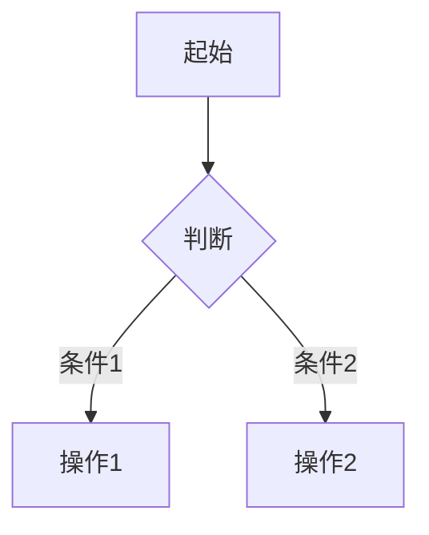
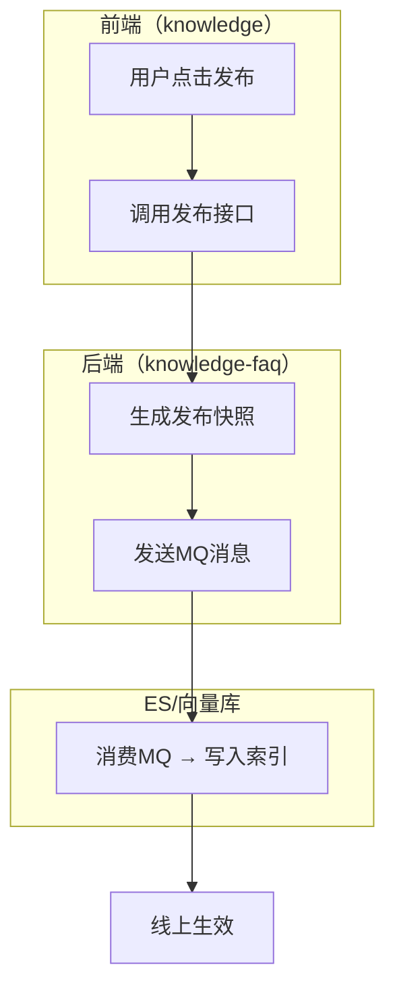

---
# PRD 核心信息（YAML frontmatter，方便下游 AI 解析）
title: "{需求标题}"
module: "{所属模块}"
version: "draft-v1"
date: "{生成日期}"
status: "draft"
roles:
  - name: "{角色名}"
    permissions: ["{权限1}", "{权限2}"]
core_entities:
  - name: "{业务概念名称，如'签章策略'而非'ESealStrategy'}"
    key_fields: ["{业务属性，如'签章类型'而非'FstrSealType'}"]
    relations: ["{业务关联，如'关联合同模板'}"]
priority: "{P0/P1/P2}"
dependencies:
  - "{依赖的现有功能或模块}"
---

# {需求标题} — PRD 草稿

# 一、需求背景

## 1.1 背景与目标

**背景：**
- {背景点 1：谁提出的，什么场景触发的}
- {背景点 2：当前的痛点}
- {背景点 3：现状问题}

**目标：**
- {目标 1}
- {目标 2}

**用户收益：**
- **{角色1}**：{具体好处}
- **{角色2}**：{具体好处}

## 1.2 需求范围

**本次包含：**
1. {功能点 1}
2. {功能点 2}

**本次不含：**
1. {排除项 1}

# 二、功能清单

| 编号 | 功能名称 | 优先级 | 状态 |
|------|----------|--------|------|
| F-01 | {功能名} | P0 | ✅ 已确认 |
| F-02 | {功能名} | P1 | ⚠️ 待确认 |

> 各功能的输入、输出、约束、交互说明、验收标准等详细描述见第五章需求详情。

# 三、业务流程图

{使用 Mermaid 语法绘制核心流程。如果流程涉及多个系统/服务/角色，使用泳道图（subgraph）按系统拆分，而不是简单的 flowchart。}

**单系统流程示例：**



**跨系统泳道图示例（涉及多个系统时必须使用此格式）：**



**异常分支：** {异常路径说明，每个判断节点至少两个分支}

# 四、数据模型

## 4.1 实体定义

> 数据模型使用业务概念命名，不使用代码类名或数据库表名。
> 技术落地时的具体表结构、字段映射由 tech-design 阶段确定。

### 4.1.1 {业务概念名称}

| 属性 | 类型 | 必填 | 说明 | 约束 |
|------|------|------|------|------|
| 编号 | 长整数 | 是 | 唯一标识 | 自增 |
| {业务属性名} | {类型} | {是/否} | {业务含义说明} | {业务规则约束} |

## 4.2 实体关系
{用业务语言描述关联关系，如"一个合同模板可配置多个签章主体"}

## 4.3 与现有数据的关系
{用业务语言说明与现有概念的衔接，如"复用现有的签章策略配置，不新增数据表"}

# 五、需求详情

## 5.1 F-01: {功能名称}

**功能描述：** {一句话描述}

**输入：** {用户输入或系统输入}
**输出：** {操作结果}
**约束：** {限制条件}

**交互说明：**
1. {页面布局描述}
2. {操作流程描述}
3. {反馈方式描述}

**交互流程：**（涉及多步骤交互时必须补充）

> 当功能包含多步操作（如分步表单、弹窗确认链、状态流转等），用步骤列表或 Mermaid 图说明完整的交互序列，
> 包括每一步的触发条件、页面跳转/弹窗行为、中断/取消后的恢复方式。

```
步骤 1: {用户操作} → {页面响应}
步骤 2: {用户操作} → {页面响应}
  ├─ 成功 → {下一步}
  └─ 失败 → {错误提示及恢复方式}
步骤 3: ...
```

**验收标准：**
1. {可测试的验收条件 1}
2. {可测试的验收条件 2}

**边界条件：**
1. {最大值/最小值/空值处理}

**错误处理：**
1. {错误场景} → {提示信息和处理方式}

# 六、权限管理

## 6.1 角色权限矩阵

| 功能 | {角色1} | {角色2} | {角色3} |
|------|---------|---------|---------|
| {功能1} | 查看/编辑 | 查看 | 无 |
| {功能2} | 全部 | 查看/编辑 | 查看 |

## 6.2 数据权限
{数据可见范围说明}

## 6.3 与现有权限体系的关系
{引用知识库 system-overview.md 的"角色与权限"章节，说明兼容情况}

---

# 七、待确认项

以下问题在澄清阶段未能完全确认，需要后续与相关方讨论后补充：

| 编号 | 问题 | 影响范围 | 建议 |
|------|------|----------|------|
| Q-01 | {待确认问题} | {影响哪些功能} | {默认处理建议} |
| Q-02 | {待确认问题} | {影响哪些功能} | {默认处理建议} |

---

# 八、默认假设

以下内容未在澄清中明确讨论，按常见做法处理。如有异议请标注：

| 编号 | 假设内容 | 依据 |
|------|----------|------|
| A-01 | {假设内容} | {知识库参考/行业惯例} |
