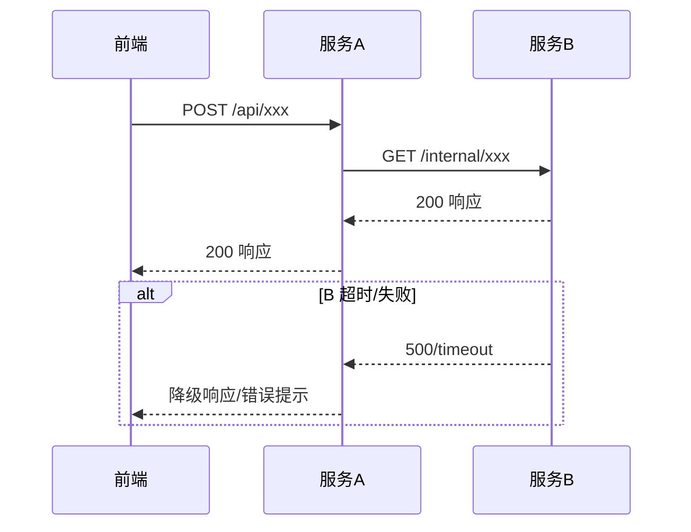

## Purpose

PRD 评审通过后，开发团队面临的第一个问题是："这个需求到底要改哪些东西？"。传统做法是开发自己读 PRD、翻代码、在脑子里拼出一个方案，然后在技术评审会上口头讲。问题是这个过程高度依赖个人经验——资深开发 10 分钟能理清的改动范围，新人可能要摸索一天。

这个 skill 读取 PRD 和项目知识库，自动分析需求涉及哪些服务、哪些表、需要新增/修改哪些接口，输出一份结构化的技术方案文档。它不是要替代开发的技术判断，而是把"读 PRD → 分析改动范围 → 设计接口 → 写文档"这个重复性劳动自动化，让开发把精力花在方案选型和架构决策上。

**核心依赖是 coding-knowledge**：技术方案的精度取决于对项目代码的了解深度。coding-knowledge 提供精确的类/方法签名、真实的 DDL、实际的调用链——有了这些，改动范围分析从"推测"升级为"定位"，接口设计从"发明"升级为"参照"。

## 输入

- PRD 文件路径（通常是 `requirements/{模块名}/prd-draft.md`）
- 原型文件路径（通常是 `requirements/{模块名}/prototype/prototype.html`，proto-gen 产出）
- `coding-knowledge/`（**核心输入**——架构、符号索引、调用链、DDL，技术分析的主要数据源）
- `prd-knowledge/`（业务上下文补充——现有功能、业务流程、角色体系）
- 项目后端代码（可选，有 coding-knowledge 时可大幅减少代码阅读量）

## 工作流程

### Step 1: 读取输入，构建技术上下文

#### 1.1 读取 PRD

提取以下信息：
- 功能清单（每个功能的输入/输出/约束）
- 数据模型（新增/修改的实体和字段）
- 业务流程图（操作流程、状态流转）
- 权限矩阵（影响鉴权逻辑的部分）
- **待确认项列表**（PRD 末尾的 Q-XX 项）——技术方案中如涉及同一问题，应保持结论方向一致或显式说明分歧原因，并引用 PRD 待确认项编号（如"关联 PRD Q-01"）

#### 1.2 读取原型

提取以下信息（原型是 PRD 的可视化补充，两者结合让接口设计更准确）：
- 页面结构和组件拆分（哪些页面、每个页面包含哪些区域/组件）
- 表格列定义（直接对应列表查询接口的返回字段）
- 表单字段和校验规则（直接对应新增/编辑接口的请求参数）
- 搜索/筛选条件（直接对应列表查询接口的请求参数）
- 弹窗和交互流程（辅助判断哪些操作需要独立接口）

#### 1.3 深度读取 coding-knowledge（核心步骤）

这是 tech-design 能精确分析改动范围的关键。不是泛泛"读取了解一下"，而是**按分析需求逐层提取精确信息**。

**第一层：架构全景**

对 PRD 涉及的每个仓库，读取 `coding-knowledge/repos/{repo}/`：

| 文件 | 提取什么 | 用在技术方案的哪里 |
|------|---------|------------------|
| `architecture.md` | 仓库职责边界（含"不负责"的描述）、包结构、分层约定 | Step 2 判断功能放在哪个服务、新建文件放在哪个包 |
| `symbols.md` | 现有 Controller/Service 的类名、方法签名、行号 | Step 2 精确定位需要修改的类和方法；Step 3 参考现有接口风格 |
| `database-schema.md` | 真实的 CREATE TABLE DDL、索引、字符集 | Step 4 直接参考建表风格，而非从 data-model.md 反推 |
| `call-chains.md` | 实际的跨服务调用链（A→B→C 的完整路径） | Step 2 跨服务调用链追踪，杜绝中间层遗漏 |

**第二层：跨服务关系**

如果 PRD 涉及多个服务的协作：
- `business/domains/{domain}/cross-service.md` → 跨仓库调用关系和数据流向
- `infra/` → 中间件使用规范（MQ topic 命名规则、缓存 key 规范等）

**第三层：比对定位**

对 PRD 中每个功能，在 symbols.md 中搜索是否有同名或语义相近的现有实现：
- 找到了 → 标记为"修改现有接口"，记录类名、方法名、行号
- 没找到 → 标记为"新增接口"，从 architecture.md 确定应放在哪个包

**这一步的产出是一张"PRD 功能 → 代码定位"映射表**，直接用于 Step 2。

#### 1.4 读取 prd-knowledge（业务上下文补充）

读取 `prd-knowledge/` 中的以下文件，补充 coding-knowledge 不涵盖的业务信息：
- `architecture.md` — 仓库清单、服务职责概述（coding-knowledge 更精确时以后者为准）
- `data-model.md` — 业务视角的实体定义和关系（对比 coding-knowledge 的 DDL 做翻译）
- `api-inventory.md` — 现有接口清单（coding-knowledge 的 symbols.md 更精确时以后者为准）
- `business-flows.md` — 现有业务流程，判断新功能嵌入点

**两套知识库的关系**：coding-knowledge 提供代码级精确信息（方法签名、DDL、调用链），prd-knowledge 提供业务语义（功能用途、角色关系、流程含义）。tech-design 同时需要两者——用 coding-knowledge 做精确的技术分析，用 prd-knowledge 理解业务意图。当两者信息冲突时，以 coding-knowledge 为准（它基于实际代码分析）。

#### 1.5 读取后端代码（按需补充）

如果 coding-knowledge 的信息不足以回答特定技术问题（如需要看某个方法的完整实现逻辑），从 symbols.md 定位到文件路径和行号，用 Read 工具读取具体代码。

有 coding-knowledge 时这一步的工作量极小——symbols.md 已提供方法签名，database-schema.md 已提供真实 DDL，只在需要看实现细节时才读代码。

### Step 2: 分析改动范围

这是技术方案最核心的部分——需求落地到底要动哪些东西。

基于 Step 1.3 产出的"PRD 功能 → 代码定位"映射表，逐功能分析：

1. **仓库/服务映射**：每个功能涉及哪些仓库、哪些模块
   - 从 `architecture.md` 的职责边界精确判断功能归属
   - 从 `symbols.md` 直接定位需要修改的 Controller/Service 类和方法（含行号）
   - **特别注意"不负责"标注**：如果 architecture.md 写了"本服务不负责 XXX"，确保不会把该逻辑分配给这个服务

2. **接口影响**：需要新增哪些接口、修改哪些现有接口
   - symbols.md 中有签名的 → 标记为"修改"，列出具体方法
   - symbols.md 中没有的 → 标记为"新增"

3. **数据库影响**：需要新增哪些表、修改哪些表
   - 对比 database-schema.md 中的现有表结构，判断是新增表还是扩展字段

4. **中间件影响**：是否需要新增 MQ Topic、ES 索引、缓存 Key
   - 从 call-chains.md 中的现有 MQ 消息流判断是否需要新增/修改 topic

5. **前端影响**：需要新增哪些页面/组件、修改哪些现有页面

#### 跨服务调用链完整性追踪（必做）

这是改动范围分析中最容易遗漏、也是代价最高的检查。

1. 从 `call-chains.md` 和 `cross-service.md` 获取涉及功能的**完整调用链**（如 A → B → C → D）。这些数据基于实际代码分析，比从架构文档推断更可靠
2. 对调用链中的**每个服务节点**，显式判断并在方案中说明：
   - 该服务是否需要改造
   - 如果需要改造：列出接口变更详情（入参、响应结构变更），从 symbols.md 定位具体方法
   - 如果不需要改造：说明原因（如"该服务仅做透传，新增字段不影响其处理逻辑"）
3. **不得跳过调用链中的任何节点**——即使某个中间层服务看起来只是透传，也必须显式确认
4. 生成改动范围后，回顾 architecture.md 中的服务调用关系，逐服务核对是否有遗漏

### Step 3: 设计接口

基于 Step 2 的分析结果，输出详细的接口设计。

每个接口包含：
- **接口路径**：HTTP Method + URL
- **所属服务**：由哪个后端仓库提供
- **请求参数**：参数名、类型、必填、说明（区分 Path/Query/Body）
- **响应结构**：返回字段名、类型、说明
- **错误码**：业务错误码和对应提示信息
- **备注**：是否复用现有接口、是否需要鉴权、是否分页

**接口风格必须与项目现有接口一致**：从 symbols.md 中参考现有 Controller 方法的签名格式（参数命名习惯、返回类型包装方式），从 call-chains.md 中参考跨服务调用的接口路径命名风格。不自己发明一套。

### Step 4: 数据库变更设计

如果 PRD 涉及数据模型变更：

1. **新增表**：输出完整的 CREATE TABLE DDL
   - **直接参考 database-schema.md 中的现有建表语句**——复刻其字段命名转换规则（`create_time` vs `created_at`）、索引命名规范（`idx_` 还是 `index_`）、字符集和引擎设定
   - 不从 prd-knowledge 的 data-model.md 反推——那是业务视角，字段名可能是中文

2. **修改表**：输出 ALTER TABLE DDL
   - 新增字段、修改字段、新增索引

3. **数据迁移**：如果涉及历史数据处理，说明迁移方案

### Step 5: 方案选型（按需）

当一个功能存在多种实现路径时，输出方案对比：

| 维度 | 方案 A | 方案 B |
|------|--------|--------|
| 实现思路 | {描述} | {描述} |
| 改动范围 | {涉及仓库/服务} | {涉及仓库/服务} |
| 开发量估算 | {人天} | {人天} |
| 优势 | {列举} | {列举} |
| 风险 | {列举} | {列举} |
| 推荐 | {是否推荐及理由} | |

不要为每个功能都强行做方案对比——只在确实存在有意义的多选方案时才输出。

### Step 6: 生成技术方案文档

在 `requirements/{模块名}/` 目录下生成 `tech-design.md`。

#### 文档结构

```markdown
---
title: "{模块名} — 技术方案"
prd_version: "{PRD 版本号}"
date: "{生成日期}"
status: "draft"
---

# {模块名} — 技术方案

## 1. 概述

### 1.1 需求摘要
{从 PRD 提取的一段话概括，说清楚这个需求要做什么}

**PRD 链接**：{PRD 文件路径或 TAPD 需求链接}

### 1.2 技术栈
{从 coding-knowledge 的 architecture.md 提取，列出本次改动涉及的技术组件}

## 2. 改动影响范围

### 2.1 总览

| 仓库 | 类型 | 改动内容 | 工作量评估 |
|------|------|----------|-----------|
| {仓库名} | {前端/后端} | {改动概要} | {S/M/L} |

### 2.2 详细改动清单

#### {仓库名}

- **新增**：{新增的文件/类/接口，从 architecture.md 推导的精确包路径}
- **修改**：{从 symbols.md 定位的文件路径:行号，具体修改的方法}
- **配置**：{配置变更，如新增 MQ Topic、权限菜单等}

### 2.3 交互时序图

对涉及多服务交互的链路，使用 Mermaid sequenceDiagram 绘制时序图。
基于 call-chains.md 中的实际调用关系绘制，而非从架构图推断。

至少覆盖以下场景：
1. 前端 → 后端 CRUD 主链路
2. 发布/同步链路（含 MQ、ES 等异步环节），标注失败分支
3. 跨服务查询链路（标注每一跳的服务名和接口路径）

每个时序图必须标注：
- 正常路径（实线箭头）
- 失败/超时分支（虚线箭头 + alt/opt 块）
- 异步操作（async 标注）



### 2.4 部署顺序
{多服务改动时的部署先后顺序及原因}

## 3. 接口设计

### 3.1 接口清单

| 编号 | 方法 | 路径 | 所属服务 | 说明 | 对应功能 |
|------|------|------|----------|------|----------|
| API-01 | POST | /xxx | {服务} | {说明} | F-01 |

### 3.2 接口详情（修改和新增接口）

#### API-01: {接口名称}

**{METHOD} {URL}**

> 对应功能：{PRD 功能编号}
> 所属服务：{仓库名}
> 代码定位：{从 symbols.md 获取的类名:方法名，新增则标注目标包路径}

**请求参数：**

| 参数 | 位置 | 类型 | 必填 | 说明 |
|------|------|------|------|------|
| {name} | Body | String | 是 | {说明} |

**响应结构：**

```json
{
  "code": 0,
  "message": "success",
  "data": { }
}
```

**错误码：**

| code | message | 说明 |
|------|---------|------|
| 10001 | {msg} | {场景} |

### 3.3 复用接口参数说明

对标注"复用"的接口，必须说明以下信息：

| 接口编号 | 类型区分参数 | 传入位置 | 是否必填 | 新类型下的行为差异 |
|----------|------------|----------|----------|-------------------|
| API-XX | knowledgeType | Body/Query | 是/否 | 与原类型完全一致 / {差异说明} |

## 4. 数据库变更

### 4.1 新增表

```sql
-- 参考 database-schema.md 中 {参考表名} 的建表风格
CREATE TABLE `{table_name}` (
  `id` bigint(20) NOT NULL AUTO_INCREMENT COMMENT '主键',
  -- ...
  PRIMARY KEY (`id`),
  KEY `idx_xxx` (`xxx`)
) ENGINE=InnoDB DEFAULT CHARSET=utf8mb4 COMMENT='{表注释}';
```

### 4.2 修改表

```sql
ALTER TABLE `{table_name}`
  ADD COLUMN `{col}` {type} DEFAULT {default} COMMENT '{注释}';
```

### 4.3 数据迁移
{如需要}

## 5. 方案选型
{仅在存在有意义的多选方案时输出}

## 6. 非功能性考虑

### 6.1 性能
{列表数据量评估、是否需要索引优化、缓存策略}
注意：如果存在"建议确认"等模糊措辞，必须要么给出明确技术结论，要么转入第 8 节待确认项。正文中不得保留开放式结论。

### 6.2 兼容性与回滚方案
{与现有功能的兼容、灰度方案}

**回滚方案**（按部署逆序列出每个服务的回滚步骤）：
1. {最后部署的服务} — 回滚操作 + 配置还原说明
2. {倒数第二个服务} — 回滚操作
- 数据库：新增表是否保留、是否需要清理数据
- 配置中心：需要还原的开关/配置项

### 6.3 安全
{涉及的鉴权变更、数据权限、敏感数据处理}

### 6.4 监控告警
{如果方案涉及异步链路（MQ、ES 同步、外部服务调用），必须有此章节}

| 监控项 | 指标 | 告警阈值 | 告警渠道 |
|--------|------|----------|----------|
| {接口/链路名} | 成功率/延迟/消费积压 | {具体阈值} | {企业微信/短信/邮件} |

## 7. 开发任务拆解

| 编号 | 任务 | 所属仓库 | 代码定位 | 依赖 | 工作量 |
|------|------|----------|---------|------|--------|
| T-01 | {任务描述} | {仓库} | {symbols.md 中的类名/方法名} | — | {人天} |
| T-02 | {任务描述} | {仓库} | {新增，目标包路径} | T-01 | {人天} |

## 8. 待确认项

| 编号 | 问题 | 影响 | 建议 |
|------|------|------|------|
| Q-01 | {技术层面的待确认项} | {影响范围} | {建议方案} |

---

## 附录

### A. PRD 功能与接口映射

| PRD 功能 | 接口编号 | 数据库变更 | 代码定位 |
|----------|----------|-----------|---------|
| F-01 | API-01, API-02 | 新增 table_a | XxxController:L45, XxxService:L120 |
| F-02 | API-03 | 修改 table_b | YyyService（新增方法） |
```

### Step 7: 输出总结

生成完成后告知用户：
1. 技术方案文件位置
2. 涉及多少个仓库/服务
3. 新增/修改的接口数量
4. 数据库变更数量（新增表/修改表）
5. 开发任务数和总工作量估算
6. 待确认的技术问题数量

## 输出目录

```
requirements/{模块名}/
├── prd-draft.md              ← PRD 终稿（输入）
├── review/                   ← prd-review 产出
├── prototype/                ← proto-gen 产出
└── tech-design.md            ← 本 skill 产出
```

## 与其他 skill 的关系

```
coding-knowledge-init                         ← 第零步：项目地图
  生成 coding-knowledge/
        ↓ (核心输入)
project-import → knowledge-init → prd-draft → prd-review → proto-gen
                                                                ↓
                                                          tech-design ← coding-knowledge/
                                                                ↓        (精确定位)
                                                    code-gen → code-review
```

- **核心依赖**：`coding-knowledge/` 是技术分析的主要数据源——symbols.md 定位代码、database-schema.md 参考 DDL、call-chains.md 追踪调用链、architecture.md 判断职责边界
- **业务补充**：`prd-knowledge/` 提供业务上下文——现有功能用途、业务流程含义、角色关系。两者冲突时以 coding-knowledge 为准
- **前置**：`proto-gen` 的原型 + `prd-review` 通过的 PRD 终稿
- **后续**：tech-design 的产出是 `code-gen` 的主要输入，`code-gen` 生成的代码变更由 `code-review` 审查
- **桥梁角色**：tech-design 是需求阶段和研发阶段的桥梁——把产品需求翻译为精确的技术方案
- **与 proto-gen 的关系**：原型把 PRD 的文字描述变成可视化的页面结构，tech-design 据此更准确地拆解前端组件、确定接口参数

## 存量修改 vs 新增功能

AI 应根据 coding-knowledge 自动判断当前需求是"修改现有功能"还是"新增功能"，并采用不同的方案策略。

**判断方法**：在 Step 1.3 的"比对定位"中，如果 PRD 中 >50% 的功能点在 symbols.md 中找到了同名或语义相近的现有实现，则为存量修改模式。

### 存量修改模式

当需求本质是修改现有功能时：

- **改动范围只写差异**：不重新描述现有逻辑。写"在 XxxService.createOrder() 方法中（L120），新增参数校验逻辑：xxx"，而不是把整个 createOrder 的完整流程重写一遍
- **接口设计标注变更点**：对修改的接口，只列出"新增参数"、"修改响应字段"、"变更校验规则"等差异项，不重复列出未变化的参数
- **DDL 只输出 ALTER**：不重复输出完整的 CREATE TABLE，只写 ALTER TABLE 语句
- **时序图聚焦变更节点**：用颜色或注释标注哪些节点是本次变更的，哪些是现有流程不变的
- **风险评估必做**：存量修改比新增功能风险更高——必须评估改动对现有调用方的影响，检查 call-chains.md 中谁在调用被修改的方法

### 新增功能模式

完整输出所有章节，不省略。

### 方案规模与需求规模匹配

小需求（如新增一个字段、修改一个校验规则）不需要完整的技术方案文档。根据改动规模调整输出：

| 改动规模 | 方案规模 | 输出内容 |
|---------|---------|---------|
| 单字段/单校验 | 轻量 | 改动范围 + DDL/代码定位，省略接口设计和时序图 |
| 单模块功能 | 标准 | 完整文档，方案选型按需 |
| 跨服务功能 | 完整 | 完整文档 + 时序图 + 部署顺序 + 回滚方案 |

## 生成原则

**改动范围是核心价值**：技术方案最重要的不是接口参数写得多详细，而是准确回答"这个需求要动哪些仓库、哪些服务、哪些表"。改动范围分析错了，后面的接口设计再精细也没用。因此 Step 2 是整个 skill 的核心。

**coding-knowledge 是分析底座**：改动范围从 symbols.md 精确定位，接口设计从现有方法签名参照，DDL 从 database-schema.md 复刻风格，调用链从 call-chains.md 追踪。没有 coding-knowledge 时仍可生成技术方案，但精度从"定位"降级为"推测"。

**接口设计遵循项目现有规范**：接口的 URL 命名、参数风格、响应结构、错误码格式都应该与项目现有接口保持一致。从 symbols.md 和 call-chains.md 提取实际使用的规范，不自己发明一套。

**DDL 与现有表风格一致**：直接参考 database-schema.md 中的真实建表语句，复刻字段命名、索引命名、字符集设定。

**工作量是参考而非承诺**：开发任务拆解中的工作量用 S/M/L 或人天给出粗略估算，明确标注为参考值。

**待确认项要有技术视角**：tech-design 中的待确认项聚焦在技术实现层面——比如"是否需要建索引"、"富文本是否需要支持图片上传"。

## Common Pitfalls

**不读 coding-knowledge 直接设计接口**：没有 symbols.md 就不知道现有接口的命名风格，没有 database-schema.md 就不知道建表规范。技术方案强依赖 coding-knowledge，如果不存在应提示用户先运行 coding-knowledge-init。

**把 PRD 的数据模型直接当 DDL**：PRD 中的数据模型是业务视角（字段名可能是中文、类型可能是"文本"），DDL 是实现视角（字段名是英文下划线、类型是 varchar/text/bigint）。要参考 database-schema.md 做翻译。

**遗漏间接影响**：一个功能的改动可能连锁影响其他服务。必须从 call-chains.md 沿着完整调用链追踪。特别注意中间层服务（BFF、编排层、网关）——它们最容易被遗漏。

**方案选型过度**：不是每个功能都需要方案对比。CRUD 功能不需要方案选型。

**正文中残留模糊措辞**：生成文档后自检，搜索"建议确认"、"待确认"、"后续确认"。出现在正文中（非第 8 节）的必须给出技术结论或移入待确认项。

**PRD 待确认项与技术方案结论打架**：如果 PRD 中 Q-01 建议"一期用固定枚举"，tech-design 不能建议"自由输入"而不做说明。要么保持一致，要么显式标注分歧原因。
